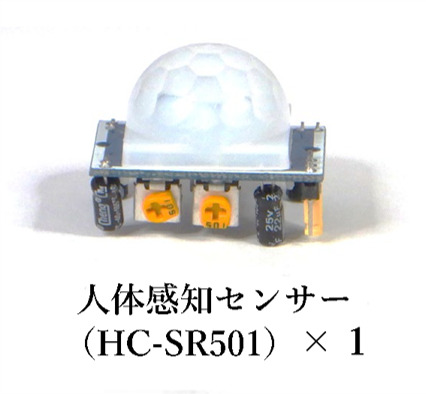
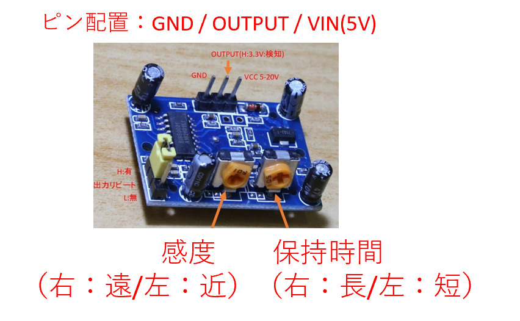
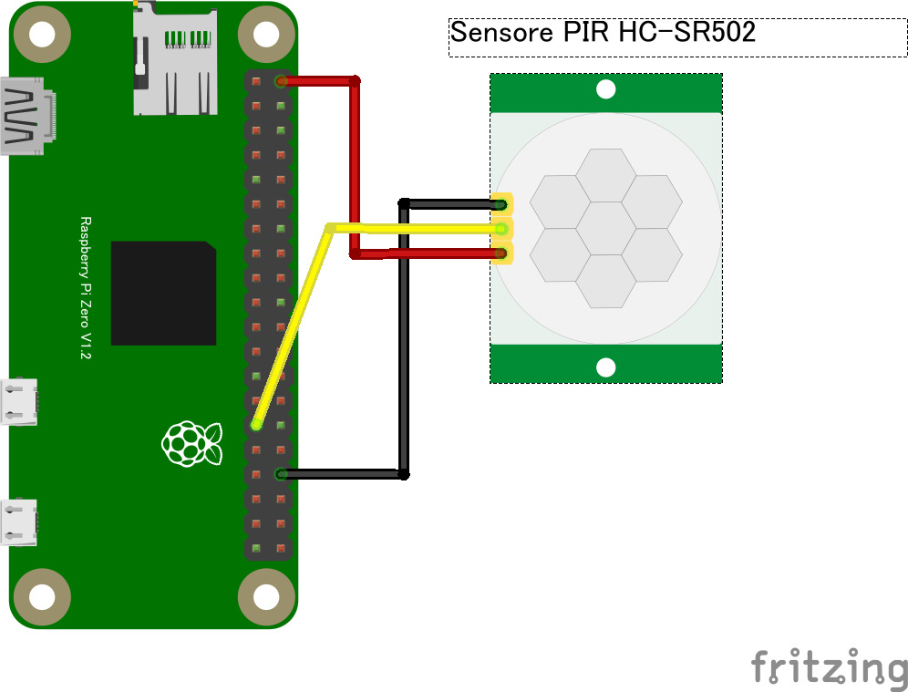

# 8.1.2 人感センサーの使い方

 

- 人感センサーは半球体の部分から赤外線が発されて人の動きや熱を検知してオンオフするセンサーです。
- 人感センサーは GPIO センサーとなり、チュートリアルのスイッチと同じ種類のセンサーになります。
- センサーに感度と保持時間を調整するつまみがあるので調節してテストしてください。
  - つまみの調整に精密ドライバーを利用します
- 人感センサーは広範囲でセンサーが反応しますので、人の居ない方に向けて、自分もなるべくセンサーから離れて動作確認するようにしてください。
- 動作確認をする際には保持時間を最短にすると調整しやすくなります。

### 回路図とプログラムサンプル

動作を確認するためのサンプルコードは `CHIRIMENパネル` から入手できます。
ブラウザでサンプルコードの中を確認したい場合は `コードを確認する` から確認出来ます。
- 人感センサー ＞ **ID：gpio-onchange　タイトル：スイッチ**
  -  [※コードを確認する](https://tutorial.chirimen.org/pizero/esm-examples/gpio-onchange/main.js)
- 人感センサー ＞ **ID：gpio-polling　タイトル：スイッチ2**
  -  [※コードを確認する](https://tutorial.chirimen.org/pizero/esm-examples/gpio-polling/main.js)

【備考】
-  [参考情報 ※CHIRIMEN Pi4 版](https://chirimen.org/chirimen/gc/top/examples/#GPIO-pirSensor)
  - サンプルコードは「スイッチ」のソースコードと共通で利用する事が出来ます。人感センサー（pir sensor）の名前でサンプル一覧には掲載されていないので注意してください。
  - 「スイッチ2」のソースコードでも動作させることが可能で、こちらは逐一センサーの状況が分かるので、調整をする際にはこちらのサンプルを利用すると便利です。

[応用センサー一覧に戻る](./chapter_8-1.md)
