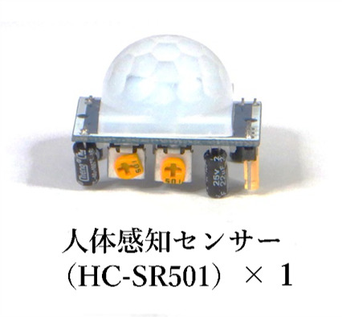
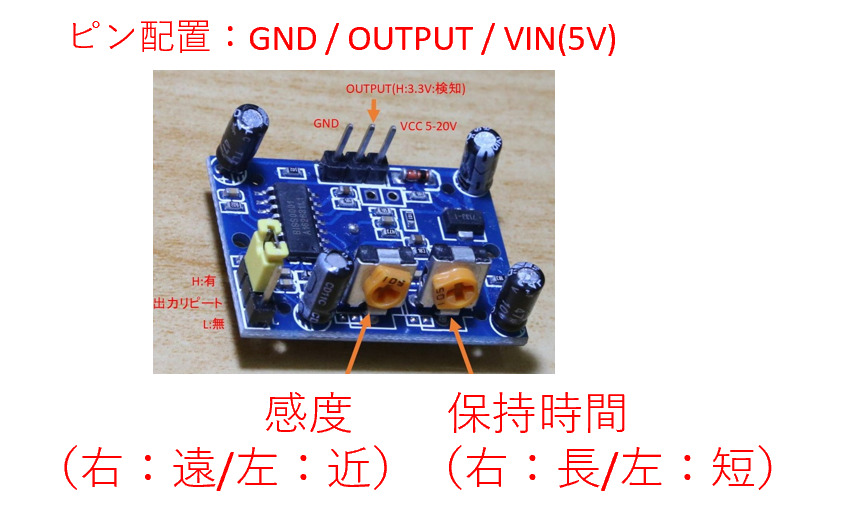
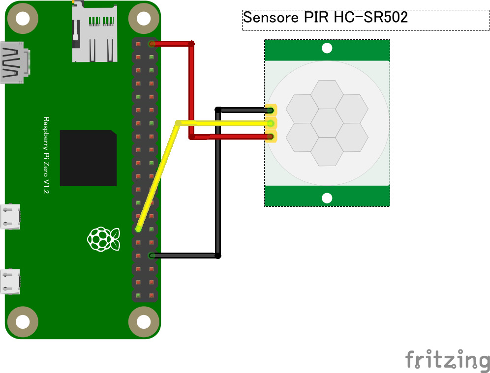

# 9.1.2 人感センサーの使い方

<iframe width="560" height="315" src="https://www.youtube.com/embed/JL_h9UcADNE" title="人感センサーの使い方(HC-SR501)" frameborder="0" allow="accelerometer; autoplay; clipboard-write; encrypted-media; gyroscope; picture-in-picture; web-share" allowfullscreen></iframe>

 

- **人感センサー**は、半球体の部分で検知した赤外線によって人の動きや熱を捉え、オンオフするセンサーです。
- 人感センサーは GPIO センサーの一種で、チュートリアルのスイッチと同じ種類です。
- センサーには感度と保持時間を調整するつまみがあるので、調節しながらテストしてください。
  - つまみの調整には精密ドライバーを使います。
- 人感センサーは広い範囲で反応するため、人のいない方向に向け、自分もセンサーからなるべく離れて動作確認してください。
- 動作確認の際は、保持時間を最短にすると調整しやすくなります。

### 回路図とプログラムサンプル

動作を確認するためのサンプルコードは `CHIRIMENパネル` から入手できます。
ブラウザでコードの中身を確認したい場合は、`コードを確認する` から確認できます。

- 人感センサー ＞ **ID：gpio-onchange 　タイトル：スイッチ**
  - [※コードを確認する](https://tutorial.chirimen.org/pizero/esm-examples/gpio-onchange/main.js)
- 人感センサー ＞ **ID：gpio-polling 　タイトル：スイッチ 2**
  - [※コードを確認する](https://tutorial.chirimen.org/pizero/esm-examples/gpio-polling/main.js)

【備考】

- [参考情報 ※CHIRIMEN Pi4 版](https://chirimen.org/chirimen/gc/top/examples/#GPIO-pirSensor)
- サンプルコードは「スイッチ」のソースコードと共用できます。人感センサー（pir sensor）という名前ではサンプル一覧に掲載されていないため、注意してください。
- 「スイッチ 2」のソースコードでも動作します。こちらはセンサーの状態を逐一確認できるため、調整する際に便利です。

[応用センサー一覧に戻る](./chapter_8-1.md)
