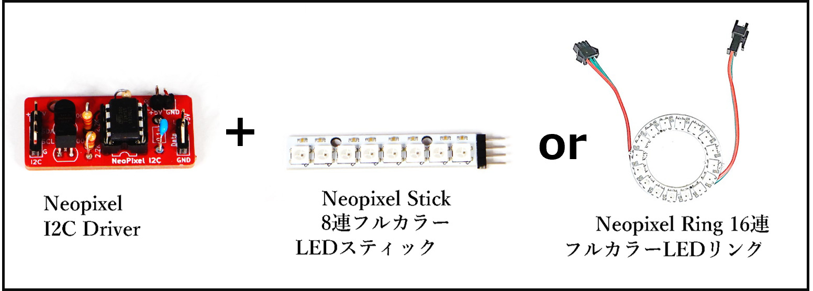
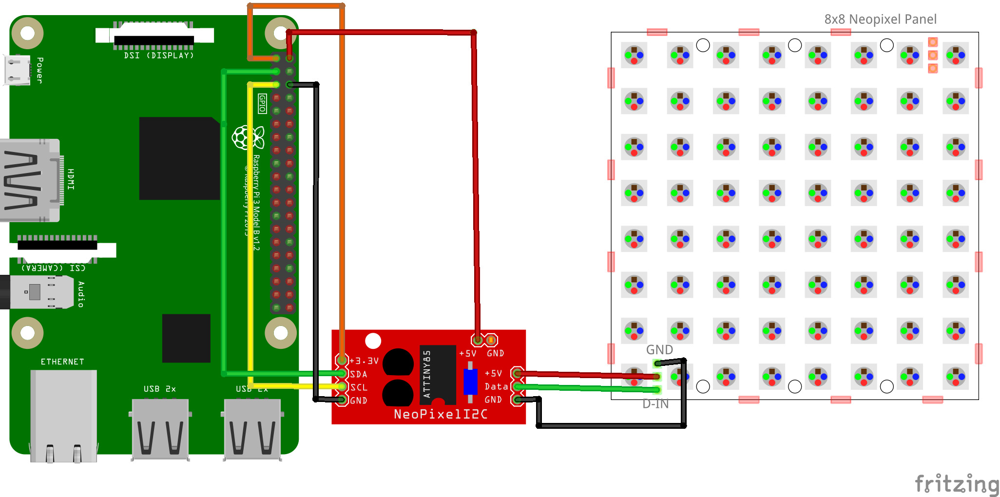

# 9.1.3 Neopixel LED の使い方

<iframe width="560" height="315" src="https://www.youtube.com/embed/q5H2xIVCMWo" title="NeoPixel LED の使い方(NeoPixel I2C driver)" frameborder="0" allow="accelerometer; autoplay; clipboard-write; encrypted-media; gyroscope; picture-in-picture; web-share" allowfullscreen></iframe>

- **Neopixel LED** は、フルカラー LED です。チュートリアルで使ってきた LED と異なり、プログラムから複数の LED の点灯や色をそれぞれ制御できます。
- 接続には、**Neopixel I2C Driver** というオープンハードウェアのドライバーボードを利用します。

### 回路図とプログラムサンプル

※ドライバと LED の接続は次のとおりです。
　赤：VIN（3.3V）、黒：GND、緑：D-IN（DI）
　すでにケーブルが接続されている場合は、同系色のケーブル同士を繋げます。

動作を確認するためのサンプルコードは `CHIRIMENパネル` から入手できます。 
ブラウザでコードの中身を確認したい場合は、`コードを確認する` から確認できます。

- NEOPIXEL LED（8 連 LED／16 連 LED） ＞ **ID：neopixel-i2c 　タイトル：NEOPIXEL LED**
  - [※コードを確認する](https://chirimen.org/pizero/esm-examples/neopixel-i2c/main.js)

【備考】

- 専用コントローラーボード Neopixel I2C Driver を使うと、接続を簡単に済ませられます。
  - Neopixel I2C Driver は[オープンソースハードで、市販品ではありません。](https://github.com/chirimen-oh/accessories/blob/master/others/neopixel_i2c_TH/)
- Neopixel LED を使うときは、図のように赤色のドライバボードと NeoPixel LED をペアで用意して試してください。
  - Neopixel LED には、丸形、棒型、マトリクス型、テープ型など、さまざまなサイズや形状の商品があります。
    

[応用センサー一覧に戻る](./chapter_8-1.md)
