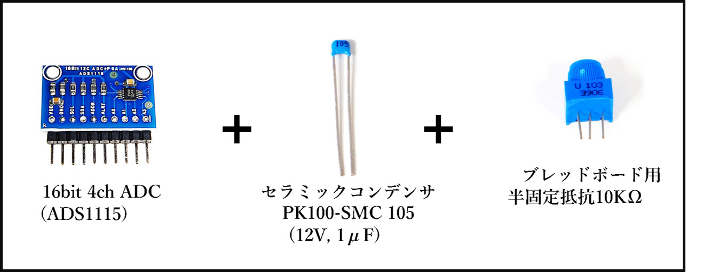
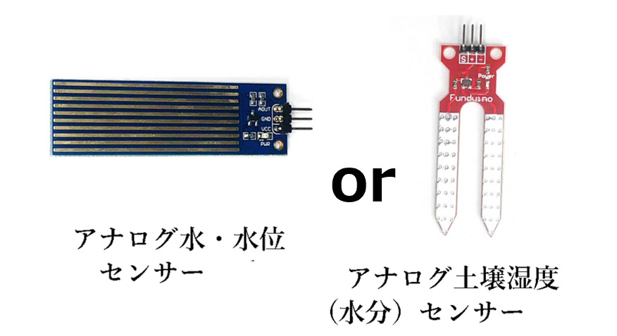
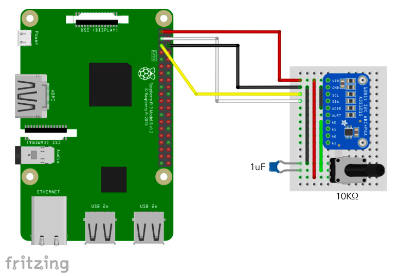
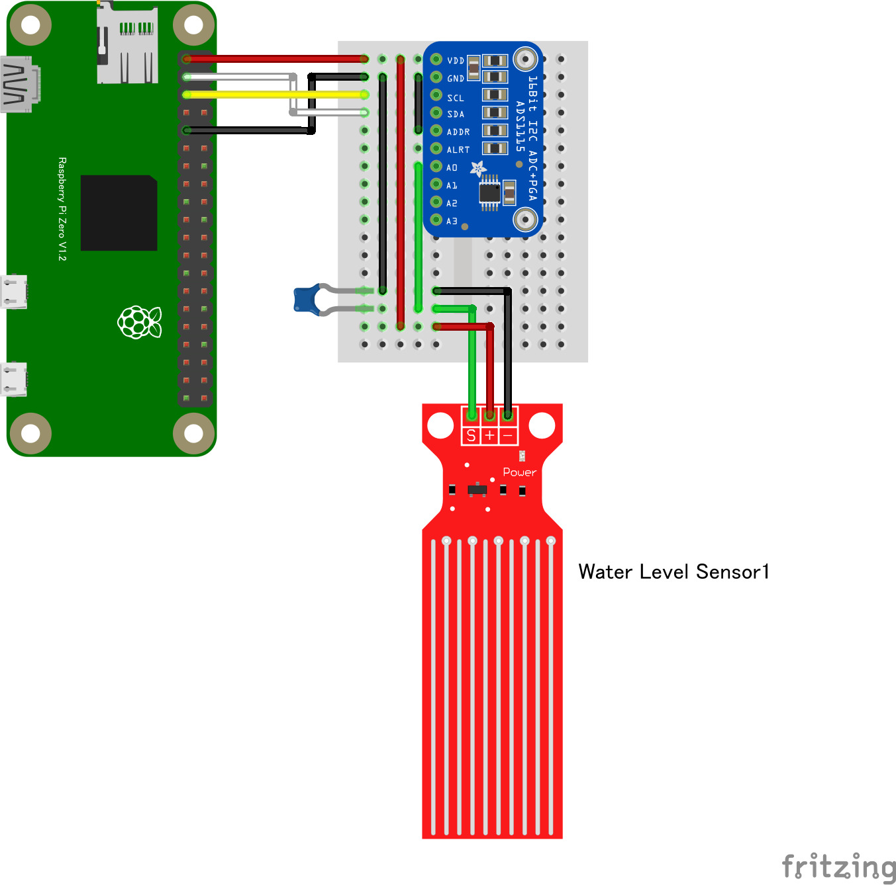

# 8.1.4 アナログセンサーの使い方

- アナログセンサーを利用する時には ADC（アナログデジタルコンバーター）を利用して値を取得して使います。
- 応用センサーキットでは半固定抵抗（つまみの代わり）を利用したアナログ値の変更の確認をするサンプルと、水位センサー・土壌湿度センサーがキットに含まれています。

### 回路図とプログラムサンプル

## アナログボリュームの回路図（半固定抵抗利用）

- アナログセンサーの利用は ADS1115 を使います。回路図にあるつまみは半固定抵抗 10KΩ を使用します。

動作を確認するためのサンプルコードは `CHIRIMENパネル` から入手できます。 
ブラウザでサンプルコードの中を確認したい場合は `コードを確認する` から確認出来ます。
- アナログボリューム ＞ **ID：ads1x15　タイトル：電圧測定（ADC）**
  -  [※コードを確認する](https://tutorial.chirimen.org/pizero/esm-examples/ads1x15/main.js) 

【備考】
- サンプルコードはアナログの値を電力に変換して表示させています。
  - 電力変化量から必要な値を求められるようにするのは、プログラムでの計算が必要です。
- 水位センサー／土壌センサーを利用する前にアナログボリュームで動作確認をするようにしてください。

## 水位センサーの回路図

- 水位センサ、土壌湿度センサもアナログセンサーです。ADS1115 を併用して使います。

動作を確認するためのサンプルコードは `CHIRIMENパネル` から入手できます。 
ブラウザでサンプルコードの中を確認したい場合は `コードを確認する` から確認出来ます。
- アナログ水位センサー／アナログ土壌センサー ＞ **ID：ads1x15　タイトル：電圧測定（ADC）**
  -  [※コードを確認する](https://tutorial.chirimen.org/pizero/esm-examples/ads1x15/main.js) 

【備考】
- 動作を確認するためには実際に水につけて確認するか、濡れタオルで覆う事で確認が出来ます。

[応用センサー一覧に戻る](./chapter_8-1.md)