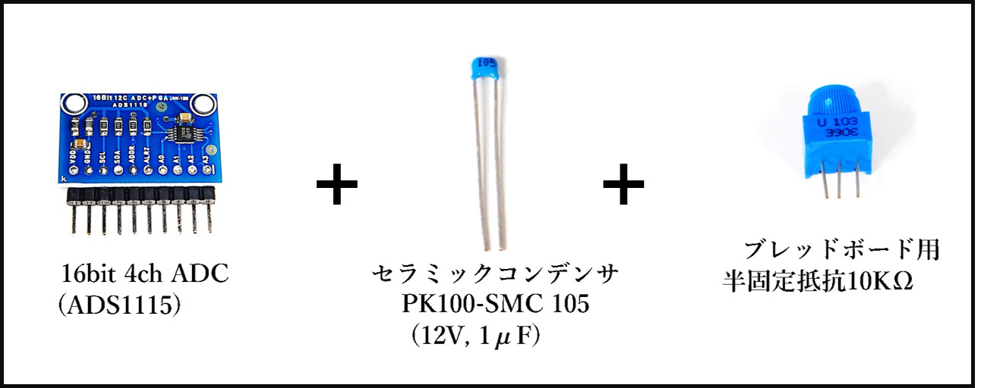
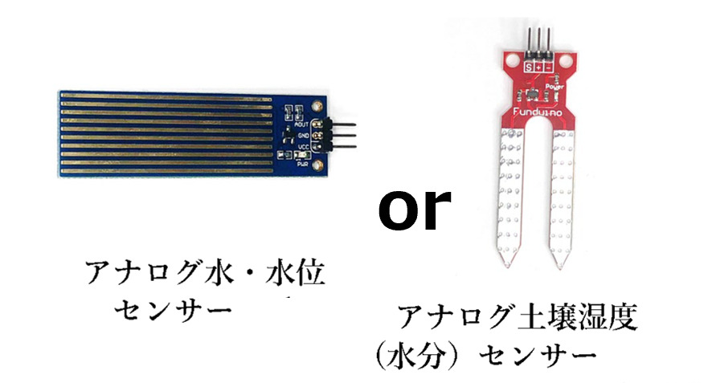
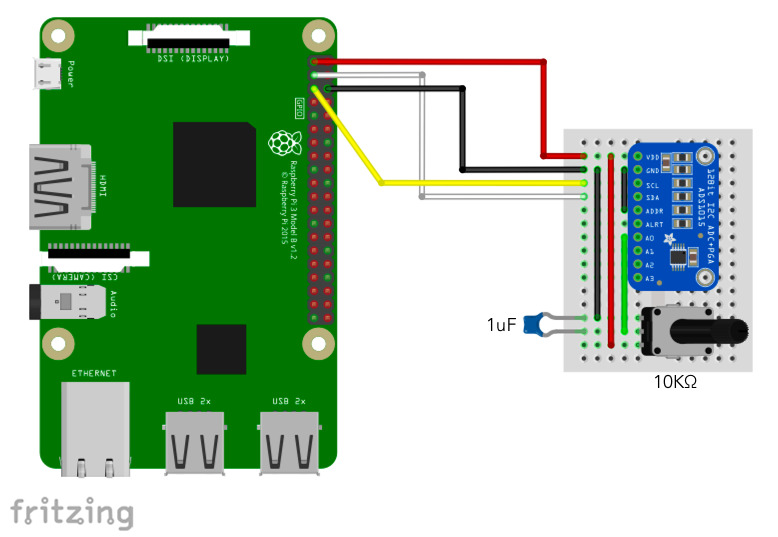
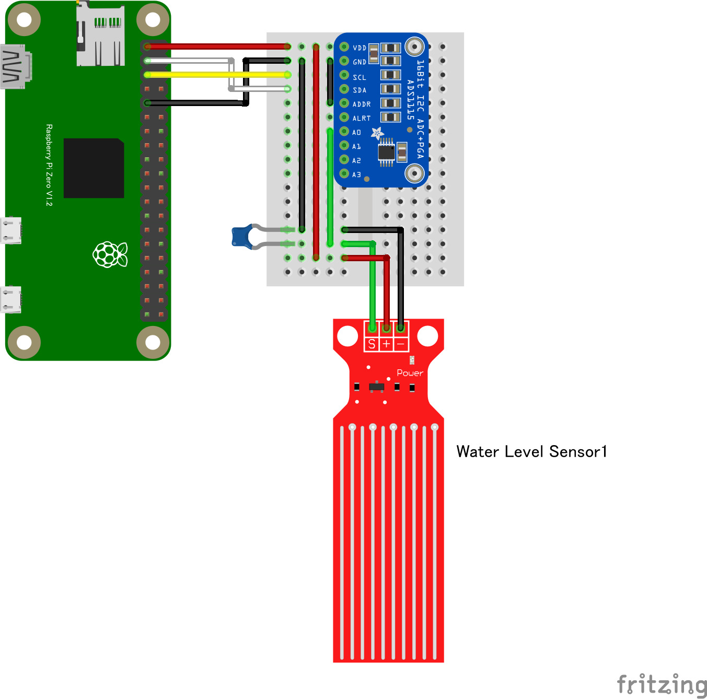

# 9.1.4 アナログセンサーの使い方

<iframe width="560" height="315" src="https://www.youtube.com/embed/f3t-IJt-ZB0" title="アナログセンサーの使い方(ボリューム・水位・土壌湿度センサー)" frameborder="0" allow="accelerometer; autoplay; clipboard-write; encrypted-media; gyroscope; picture-in-picture; web-share" allowfullscreen></iframe>

- アナログセンサーの値を取得するには、ADC（アナログデジタルコンバーター）を利用します。
- 応用センサーキットには、半固定抵抗（つまみの代わり）でアナログ値の変化を確認するサンプルと、水位センサー、土壌湿度センサーが含まれています。

### 回路図とプログラムサンプル

## アナログボリュームの回路図（半固定抵抗利用）

- アナログセンサーの利用には ADS1115 を使います。回路図のつまみには半固定抵抗 10KΩ を使用します。

動作確認用のサンプルコードは `CHIRIMENパネル` から入手できます。 
ブラウザ上でコードの中身を見たい場合は `コードを確認する` から参照できます。

- アナログボリューム ＞ **ID：ads1x15 　タイトル：電圧測定（ADC）**
  - [※コードを確認する](https://chirimen.org/pizero/esm-examples/ads1x15/main.js)

【備考】

- サンプルコードは、アナログの値を電力に変換して表示します。
  - 電力の変化量から必要な値を求めるには、プログラムでの計算が必要です。
- 水位センサー／土壌センサーを利用する前に、アナログボリュームで動作確認をしてください。

## 水位センサーの回路図

- 水位センサー、土壌湿度センサーもアナログセンサーです。ADS1115 と組み合わせて使います。

動作確認用のサンプルコードは `CHIRIMENパネル` から入手できます。 
ブラウザ上でコードの中身を見たい場合は `コードを確認する` から参照できます。

- アナログ水位センサー／アナログ土壌センサー ＞ **ID：ads1x15 　タイトル：電圧測定（ADC）**
  - [※コードを確認する](https://chirimen.org/pizero/esm-examples/ads1x15/main.js)

【備考】

- 動作確認は、実際に水につけるか、濡れタオルで覆うことで行えます。

[応用センサー一覧に戻る](./chapter_8-1.md)
