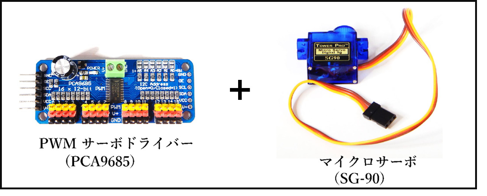
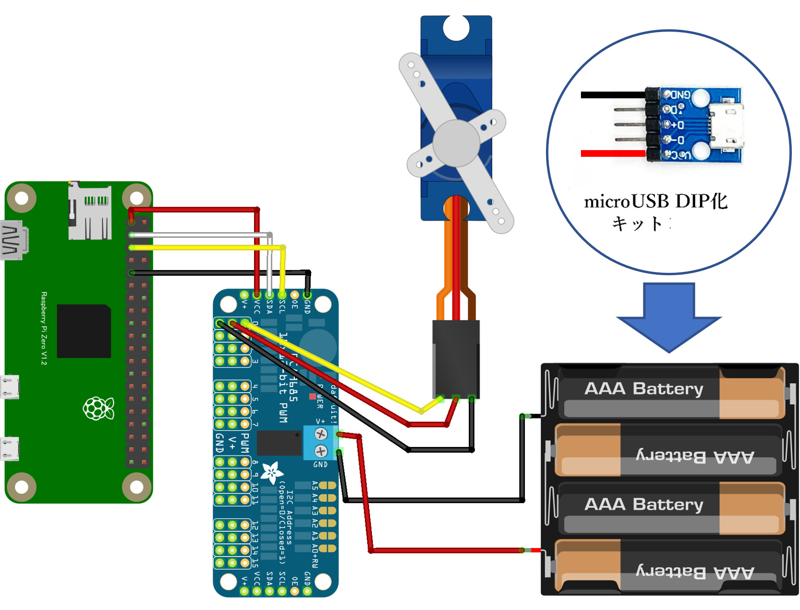
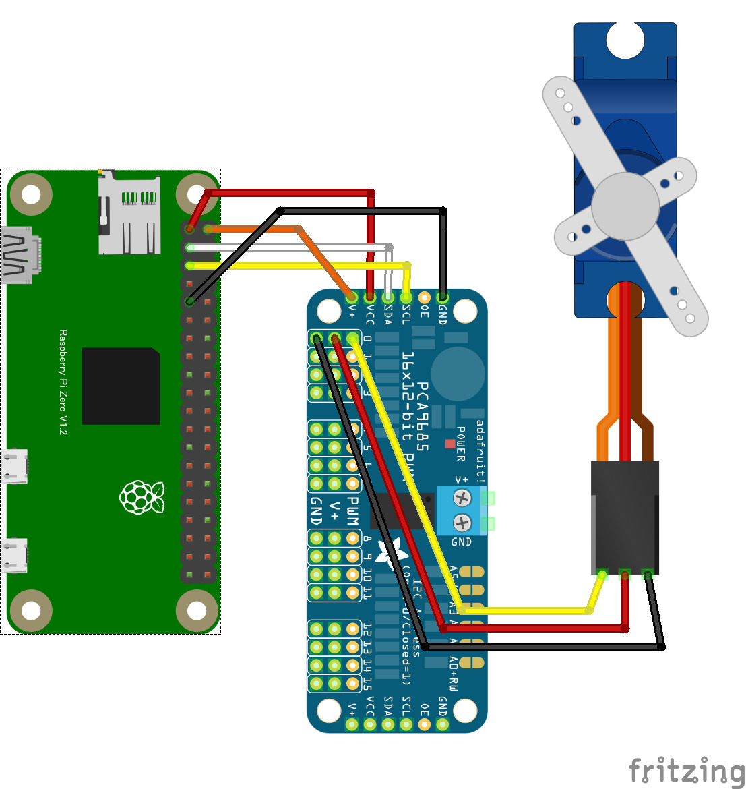

# 8.1.5 アクチュエーター（サーボモーター）の使い方

- モーターを使用する場合はモータードライバーを経由して制御します。
- モーターを動かすため外部から電力を取る必要があります。

### 回路図とプログラムサンプル

動作を確認するためのサンプルコードは `CHIRIMENパネル` から入手できます。 
ブラウザでサンプルコードの中を確認したい場合は `コードを確認する` から確認出来ます。
- アクチュエーター（サーボモーター） ＞ **ID：pca9685　タイトル：サーボモータ**
  -  [※コードを確認する](https://tutorial.chirimen.org/pizero/esm-examples/pca9685/main.js) 

【備考】
- 給電方法は電池ボックス又は USB DIP 化キットを使ったモバイルバッテリーの使用、電源モジュールを使った ACアダプタ給電などを使用します。
- サーボドライバーの給電接続には精密ドライバーを使用します

## モバイルバッテリーの利用方法

- microUSB DIP化キットを使用してモバイルバッテリーを電池ボックスとして使用する事が出来ます。
- 電源として利用するだけであれば、VIN と GND の 2ヶ所にジャンパーワイヤーを使用して接続が出来ます。

## PiZero から給電する回路図

- 低消費電力のモーター（例：SG-90）1個の場合、RasPi Zero からの電力供給でも動作させられるものもあります。

[応用センサー一覧に戻る](./chapter_8-1.md)
