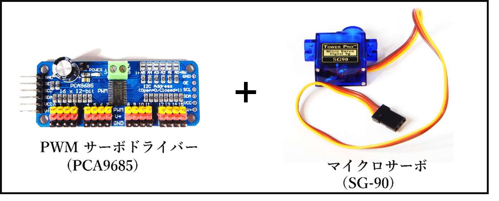
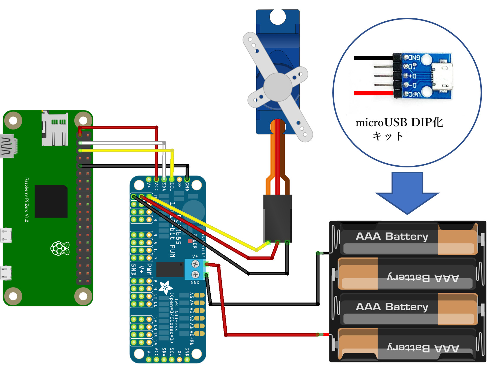
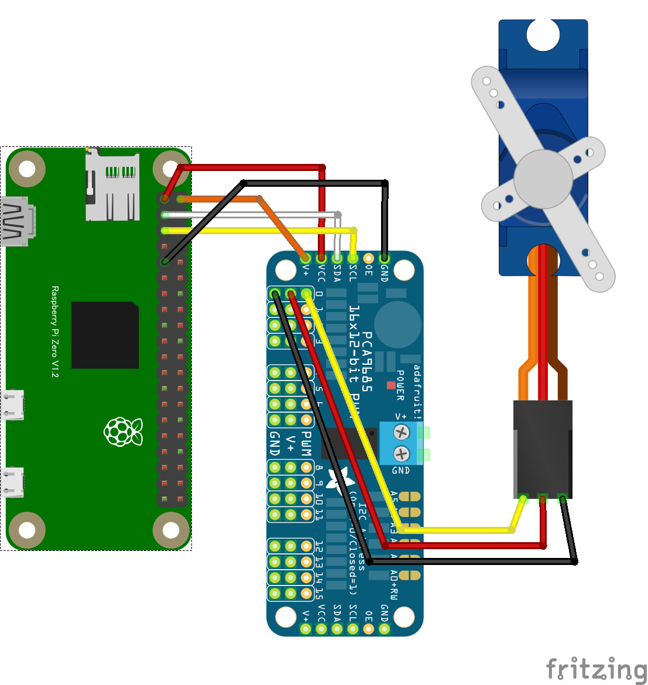

# 9.1.5 アクチュエーター（サーボモーター）の使い方

<iframe width="560" height="315" src="https://www.youtube.com/embed/etCNoFxsaJ0" title="マイクロサーボモーターの使い方" frameborder="0" allow="accelerometer; autoplay; clipboard-write; encrypted-media; gyroscope; picture-in-picture; web-share" allowfullscreen></iframe>

- モーターを使用する場合は、モータードライバーを経由して制御します。
- モーターを動かすには、外部から電力を取る必要があります。

### 回路図とプログラムサンプル

動作確認用のサンプルコードは `CHIRIMENパネル` から入手できます。 
ブラウザ上でコードの中身を見たい場合は `コードを確認する` から参照できます。

- アクチュエーター（サーボモーター） ＞ **ID：pca9685 　タイトル：サーボモータ**
  - [※コードを確認する](https://tutorial.chirimen.org/pizero/esm-examples/pca9685/main.js)

【備考】

- 給電方法には、電池ボックス、USB DIP 化キットを使ったモバイルバッテリー、電源モジュールを使った AC アダプタなどがあります。
- サーボドライバーの給電接続には精密ドライバーを使用します。

## モバイルバッテリーの利用方法

- microUSB DIP 化キットを使用すると、モバイルバッテリーを電池ボックスとして使えます。
- 電源として利用するだけであれば、VIN と GND の 2 ヶ所をジャンパーワイヤーで接続すれば使えます。

## PiZero から給電する回路図

- 低消費電力のモーター（例：SG-90）1 個であれば、RasPi Zero からの電力供給だけで動作する場合もあります。

[応用センサー一覧に戻る](./chapter_8-1.md)
