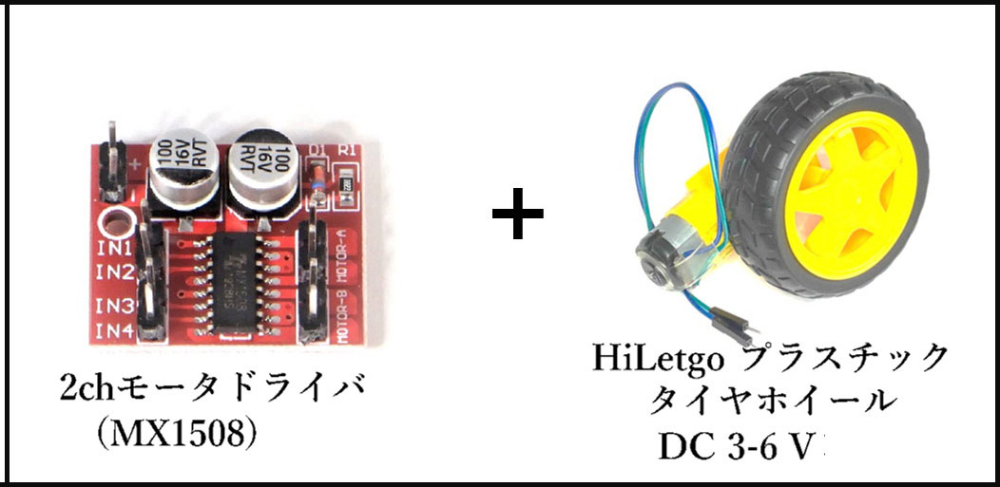
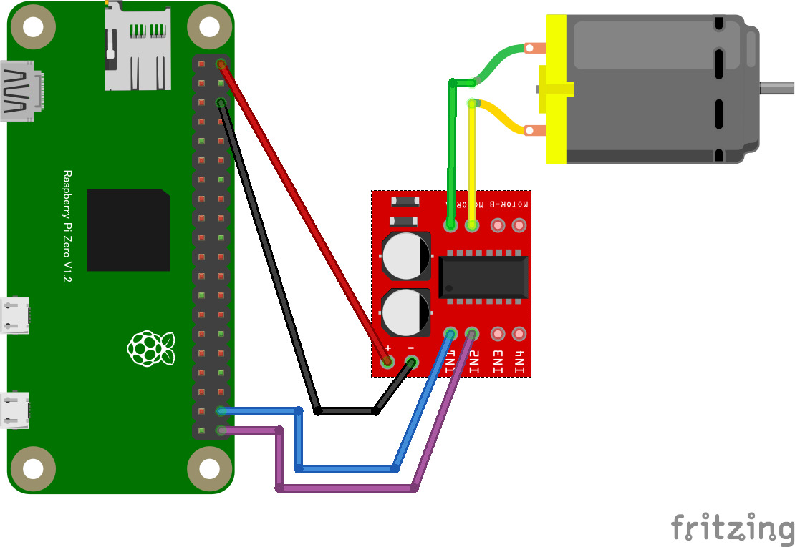

# 8.1.6 アクチュエーター（DCモーター）の使い方

- モーターを使用する場合はモータードライバーを経由して制御します。
- モーターを動かすため外部から電力を取る必要があります。
  - このサンプルは PiZero から外部電力を給電しています。

### 回路図とプログラムサンプル
## hbridge1 の回路図（MX1508利用）

- このサンプルは GPIO Examples のサンプルです。

動作を確認するためのサンプルコードは `CHIRIMENパネル` から入手できます。 
ブラウザでサンプルコードの中を確認したい場合は `コードを確認する` から確認出来ます。
- アクチュエーター（DCモーター） ＞ **ID：hbridge1　タイトル：モータ正転・逆転制御**
  -  [※コードを確認する](https://tutorial.chirimen.org/pizero/esm-examples/hbridge1/main.js)

【備考】
- L298N と同様に動作する MX1508 で接続した回路図を掲載します。
  - モーターの動作にジャンパーワイヤー等の他の物を巻き込まない様に、動作前にモーター周りを注意確認してください。

[応用センサー一覧に戻る](./chapter_8-1.md)