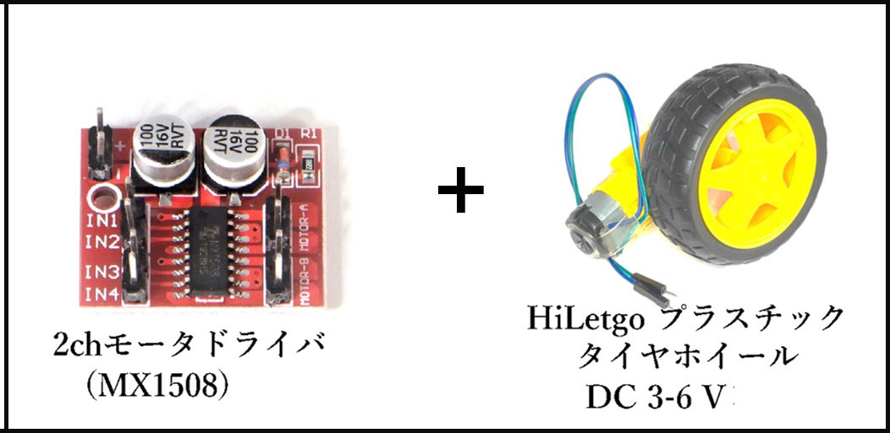

# 9.1.6 アクチュエーター（DC モーター）の使い方

<iframe width="560" height="315" src="https://www.youtube.com/embed/5PsXPz0dllk" title="DCモーターの使い方(MX1508)" frameborder="0" allow="accelerometer; autoplay; clipboard-write; encrypted-media; gyroscope; picture-in-picture; web-share" allowfullscreen></iframe>

- モーターを使用する場合は、モータードライバーを経由して制御します。
- モーターを動かすには、外部から電力を取る必要があります。
  - このサンプルでは、PiZero から外部電力を給電しています。

### 回路図とプログラムサンプル

## hbridge1 の回路図（MX1508 利用）

- このサンプルは GPIO Examples に含まれています。

動作確認用のサンプルコードは `CHIRIMENパネル` から入手できます。 
ブラウザ上でコードの中身を見たい場合は `コードを確認する` から参照できます。

- アクチュエーター（DC モーター） ＞ **ID：hbridge1 　タイトル：モータ正転・逆転制御**
  - [※コードを確認する](https://tutorial.chirimen.org/pizero/esm-examples/hbridge1/main.js)

【備考】

- L298N と同様に動作する MX1508 を使って接続した回路図を掲載します。
  - モーターの動作にジャンパーワイヤーなどを巻き込まないよう、動作前にモーター周りを確認してください。

[応用センサー一覧に戻る](./chapter_8-1.md)
