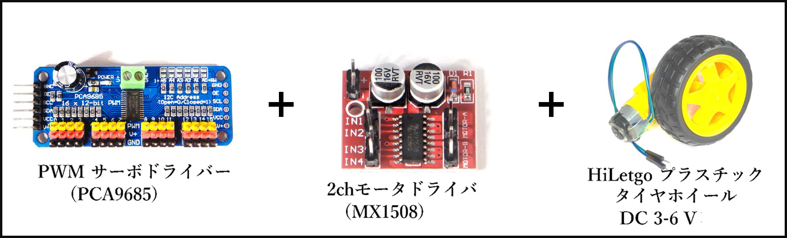
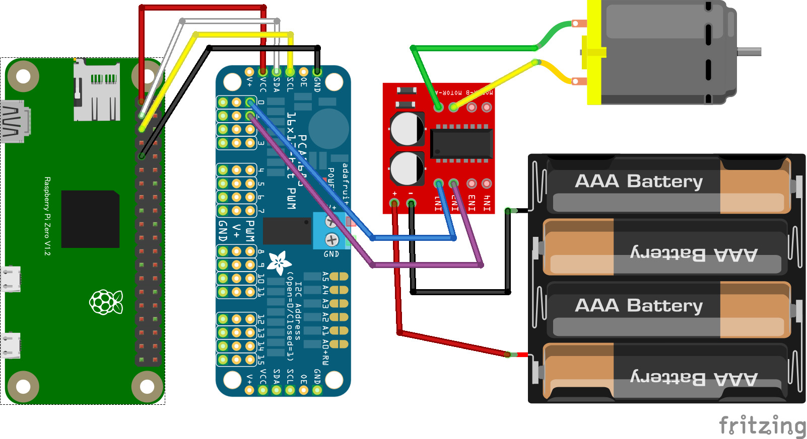
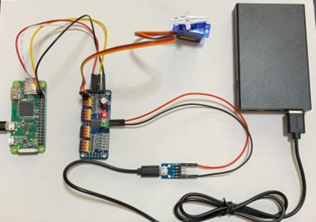

# 9.1.7 アクチュエーター（DC モーター）の使い方（PWM 駆動）

<iframe width="560" height="315" src="https://www.youtube.com/embed/hF_z429Izbk" title="DCモーターの使い方(PWMサーボドライバー利用)" frameborder="0" allow="accelerometer; autoplay; clipboard-write; encrypted-media; gyroscope; picture-in-picture; web-share" allowfullscreen></iframe>

- モーターを使用する場合は、モータードライバーを経由して制御します。
- モーターを動かすには、外部から電力を取る必要があります。

### 回路図とプログラムサンプル

## hbridge2-pca9685pwm の回路図（MX1508 利用）

- このサンプルは I2C Examples に含まれています。

動作確認用のサンプルコードは `CHIRIMENパネル` から入手できます。 
ブラウザ上でコードの中身を見たい場合は `コードを確認する` から参照できます。

- アクチュエーター（DC モーター） ＞ **ID：hbridge2-pca9685pwm 　タイトル：モータ正転・逆転・速度制御**
  - [※コードを確認する](https://tutorial.chirimen.org/pizero/esm-examples/gpio-onchange/main.js)

【備考】

- PWM サーボドライバーと組み合わせると、PWM 駆動が可能になります。
  - モーターの回転速度も PWM で制御できるので、加速や減速も行えます。
  - 動作させる前に、モーターがジャンパーワイヤーなどを巻き込まないよう注意してください。
  - 電池は USB DIP を使用してモバイルバッテリーに変えることもできます。

## （参考）モバイルバッテリーの利用方法

- microUSB DIP 化キットを使用すると、モバイルバッテリーを電池ボックスとして使えます。
- 電源として利用するだけであれば、VIN と GND の 2 ヶ所をジャンパーワイヤーで接続すれば使えます。

[応用センサー一覧に戻る](./chapter_8-1.md)
