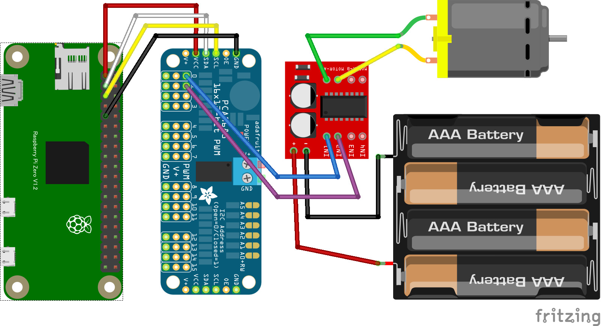

# 8.1.7 アクチュエーター（DCモーター）の使い方（PWM駆動）

- モーターを使用する場合はモータードライバーを経由して制御します。
- モーターを動かすため外部から電力を取る必要があります。

### 回路図とプログラムサンプル
## hbridge2-pca9685pwm の回路図（MX1508利用）

- このサンプルは I2C Examples になります。

動作を確認するためのサンプルコードは `CHIRIMENパネル` から入手できます。 
ブラウザでサンプルコードの中を確認したい場合は `コードを確認する` から確認出来ます。
- 人感センサー ＞ **ID：hbridge2-pca9685pwm　タイトル：モータ正転・逆転・速度制御**
  -  [※コードを確認する](https://tutorial.chirimen.org/pizero/esm-examples/gpio-onchange/main.js)

【備考】
- PWMサーボドライバーと組み合わせた動作の場合は、PWM駆動が可能になります。
  - モーターの回転速度も PWM で制御できるので加速や減速などを行う事も可能です。
  - 動作させる前にモーターがジャンパーワイヤー等の他の物を巻き込まない様に注意してください。
  - 電池は USB DIP を使用してモバイルバッテリーに変える事も可能です。

## （参考）モバイルバッテリーの利用方法

- microUSB DIP化キットを使用してモバイルバッテリーを電池ボックスとして使用する事が出来ます。
- 電源として利用するだけであれば、VIN と GND の 2ヶ所にジャンパーワイヤーを使用して接続が出来ます。

[応用センサー一覧に戻る](./chapter_8-1.md)