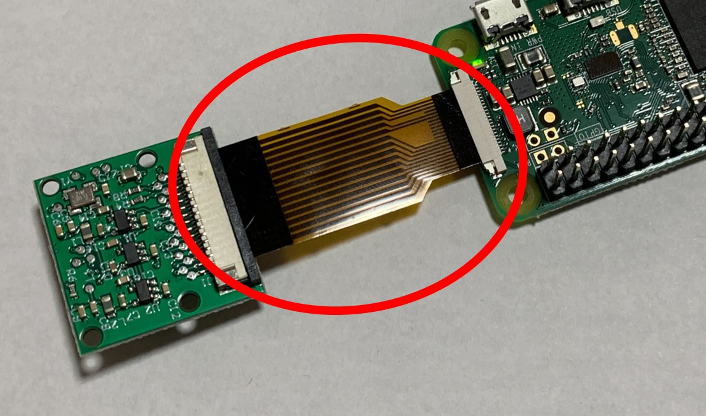
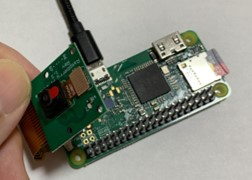

# 8.1.8 RaspberryPi のカメラに関する注意
　

- 接続端子・フラットケーブルは壊れやすい
  - 無理に引っ張らない
  - 折り曲げない様に注意
- カメラ接続確認のコマンド

```
$ vcgencmd get_camera 
supported=1 detected=1, libcamera interfaces=0
```
- detected=1 と表示されていたら正しく接続が出来ています。

[応用センサー一覧に戻る](./chapter_8-1.md)