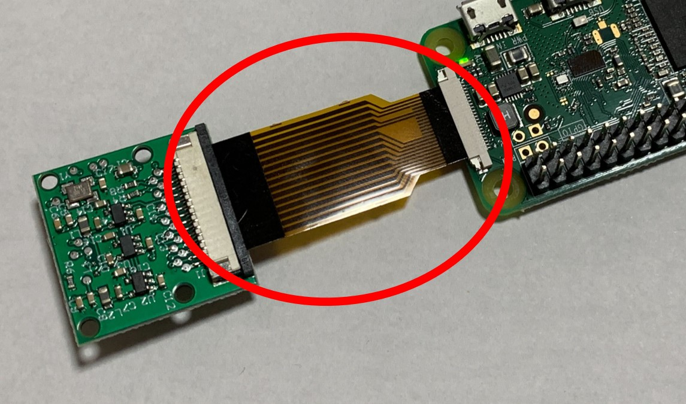
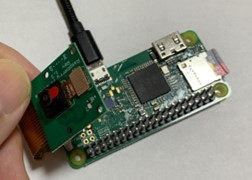

# 9.1.8 RaspberryPi のカメラに関する注意

　

- 接続端子とフラットケーブルは壊れやすい
  - 無理に引っ張らない
  - 折り曲げないように注意する

## カメラの動作テスト

まずカメラが認識されているかを確かめましょう。

```
$ rpicam-still --list-cameras
Available cameras
-----------------
0 : ov5647 [2592x1944 10-bit GBRG] (/base/soc/i2c0mux/i2c@1/ov5647@36)
    Modes: 'SGBRG10_CSI2P' : 640x480 [58.92 fps - (16, 0)/2560x1920 crop]
                             1296x972 [43.25 fps - (0, 0)/2592x1944 crop]
                             1920x1080 [30.62 fps - (348, 434)/1928x1080 crop]
                             2592x1944 [15.63 fps - (0, 0)/2592x1944 crop]
```

0 番のカメラが一覧に出ていれば、フラットケーブルの向きも接触も問題ありません。

認識できたら、撮影に進みます。

```
rpicam-still --width 640 --height 480 -o test.jpg
```

作業ディレクトリに test.jpg ができていれば、動作確認は終わりです。

詳細: [Camera software - Raspberry Pi Documentation](https://www.raspberrypi.com/documentation/computers/camera_software.html)

[応用センサー一覧に戻る](./chapter_8-1.md)
