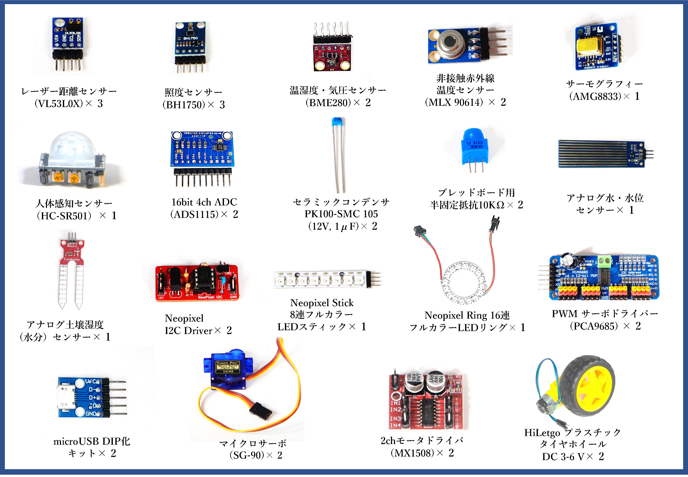

# 8.1 応用センサーキットの使い方
## 応用センサーキットの一覧

## 目次
- [単体で動作確認できるセンサーの使い方](./chapter_8-1-1.md)
  - 距離センサー／照度センサー／温湿度・気圧センサー／非接触赤外線温度センサー／サーモグラフィー
- [人感センサーの使い方](./chapter_8-1-2.md)
- [Neopixel LED の使い方](./chapter_8-1-3.md)
- [アナログセンサーの使い方](./chapter_8-1-4.md)
- [アクチュエーター（サーボモーター）の使い方](./chapter_8-1-5.md)
- アクチュエーター（DCモーター）の使い方
  - [hbridge1 の回路図（MX1508利用）](./chapter_8-1-6.md)
  - [hbridge2-pca9685pwm の回路図（MX1508利用）](./chapter_8-1-7.md)
- [RaspberryPi のカメラに関する注意](./chapter_8-1-8.md)

---

- 応用センサーキットはハッカソン等のアイディアを実装する際に使い勝手の良いセンサーを集めたキットです。
- CHIRIMEN チュートリアルで習得したスキルを使って実際に動作させることが出来ます。
- 一部のセンサーは特性を知る必要があるのでその解説を行います。