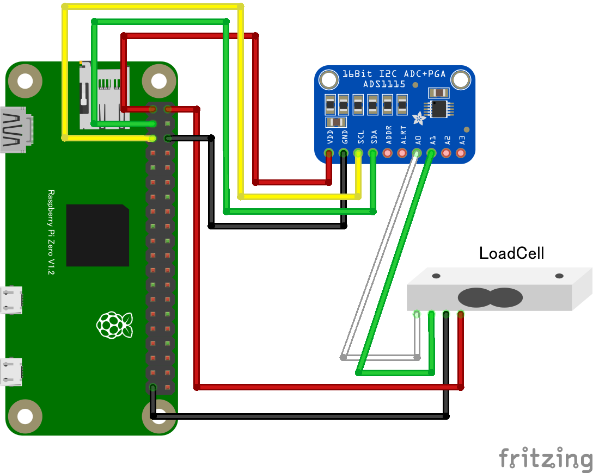

# ADS1115 16bitADC <a href="https://www.analog.com/jp/education/education-library/faqs/faq_mm_163_differential_input.html" target="_blank">差動入力</a>による<a herf="https://www.aandd.co.jp/products/loadcell/faq/cell_faq_1.html" target="_blank">ロードセル</a>の使用

## 配線図

