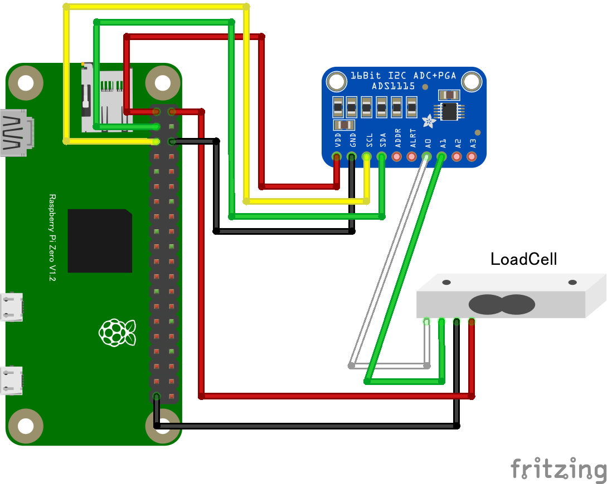

# ADS1115 16bitADC <a href="https://www.analog.com/jp/education/education-library/faqs/faq_mm_163_differential_input.html" target="_blank">差動入力</a>による<a herf="https://www.aandd.co.jp/products/loadcell/faq/cell_faq_1.html" target="_blank">ロードセル</a>の使用

## 配線図



## ドライバのインストール

```sh
npm i node-web-i2c @chirimen/ads1x15
```

## サンプルコード

同ディレクトリの [main.js](main.js) と同じ内容です。

```javascript
import { requestI2CAccess } from "node-web-i2c";
import ADS1X15 from "@chirimen/ads1x15";
const sleep = (msec) => new Promise((resolve) => setTimeout(resolve, msec));

const i2cAccess = await requestI2CAccess();
const i2cPort = i2cAccess.ports.get(1);
const ads1115 = new ADS1X15(i2cPort, 0x48);
// If you uses ADS1115, you have to select "true", otherwise select "false".
await ads1115.init(true, 7); // High Gain
console.log("init complete");
let firstTime = true;
let tare;
while (true) {
  const difA = await ads1115.read("0,1"); // p0-p1 differential mode
  console.log(
    "dif chA(0-1):" +
      difA.toString(16) +
      " : " +
      ads1115.getVoltage(difA).toFixed(6) +
      "V",
  );
  if (firstTime) {
    tare = difA;
    firstTime = false;
  }
  const weight = difA - tare;
  console.log(
    "rawData - Tare:" +
      weight.toString(16) +
      " : " +
      ads1115.getVoltage(weight).toFixed(6) +
      "V",
  );
  await sleep(500);
}
```

Note: このサンプルはロードセルを差動入力（チャンネル 0-1 間）で読み取り、起動直後の測定値を風袋（tare）として差し引いて表示します。ADS1115 で 4 チャンネルの電圧を個別に読み取る一般的な例は [ads1x15](../ads1x15) を参照してください。
