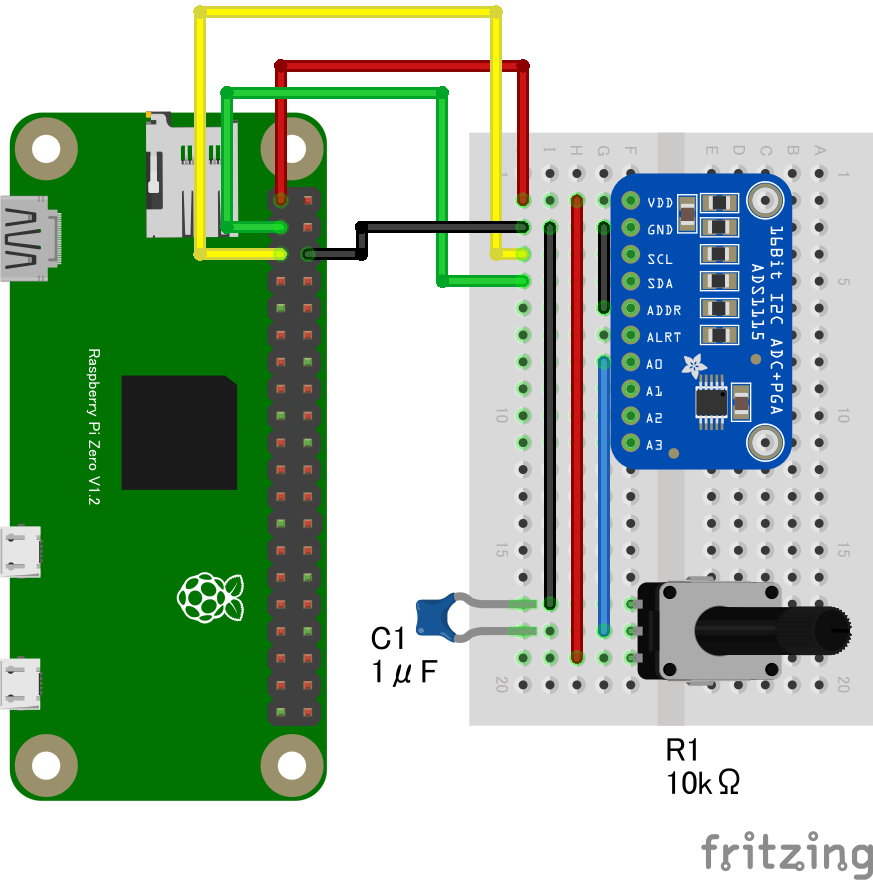

# ADS1115 16bitADC

## 配線図



## ドライバのインストール

```sh
npm i node-web-i2c @chirimen/ads1x15
```

## サンプルコード

同ディレクトリの [main.js](main.js) と同じ内容です。

```javascript
import { requestI2CAccess } from "node-web-i2c";
import ADS1X15 from "@chirimen/ads1x15";
const sleep = (msec) => new Promise((resolve) => setTimeout(resolve, msec));

const i2cAccess = await requestI2CAccess();
const i2cPort = i2cAccess.ports.get(1);
const ads1x15 = new ADS1X15(i2cPort, 0x48);
// If you uses ADS1115, you have to select "true", otherwise select "false".
await ads1x15.init(true);
console.log("init complete");
while (true) {
  let output = "";
  // ADS1115 has 4 channels.
  for (let channel = 0; channel < 4; channel++) {
    const rawData = await ads1x15.read(channel);
    const voltage = ads1x15.getVoltage(rawData);
    output += `CH${channel}:${voltage.toFixed(3)}V `;
  }
  console.log(output);

  await sleep(500);
}
```
