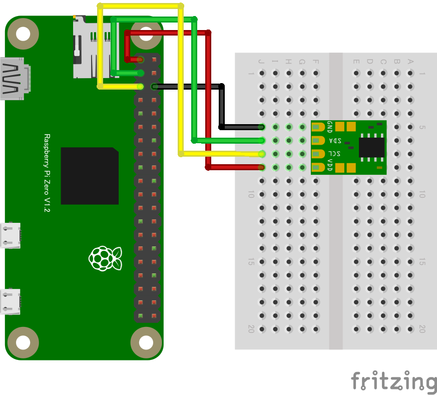
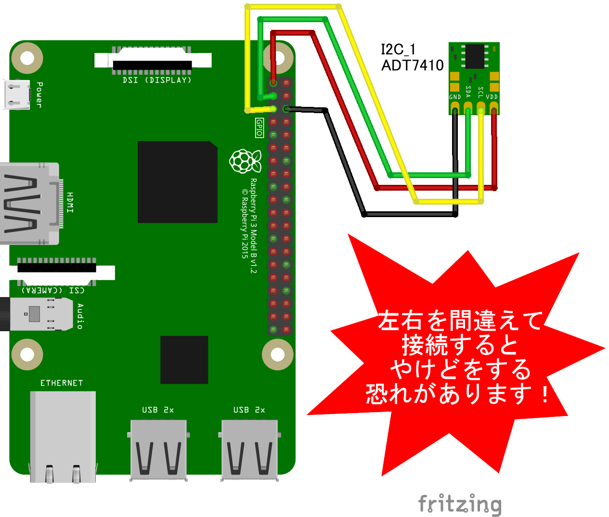

# ADT7410 温度センサー

## 配線図




## ドライバのインストール

```sh
npm i node-web-i2c @chirimen/adt7410
```

## サンプルコード

同ディレクトリの [main.js](main.js) と同じ内容です。

```javascript
import { requestI2CAccess } from "node-web-i2c";
import ADT7410 from "@chirimen/adt7410";
const sleep = (msec) => new Promise((resolve) => setTimeout(resolve, msec));

const i2cAccess = await requestI2CAccess();
const i2cPort = i2cAccess.ports.get(1);
const adt7410 = new ADT7410(i2cPort, 0x48);
await adt7410.init();
while (true) {
  const value = await adt7410.read();
  console.log(`${value} degree`);
  await sleep(1000);
}
```
