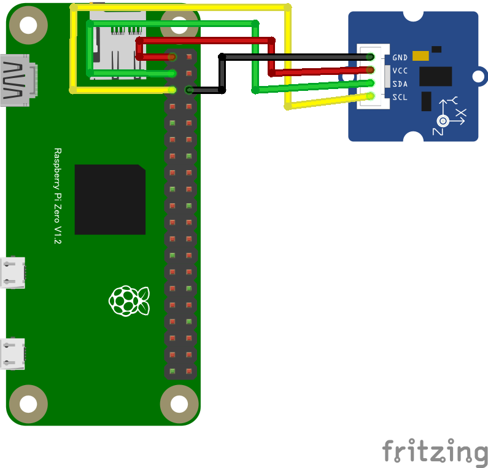

# ADXL345 Grove Accelerometer 3 軸加速度センサー

## 配線図



## ドライバのインストール

```sh
npm i node-web-i2c @chirimen/grove-accelerometer
```

## サンプルコード

同ディレクトリの [main.js](main.js) と同じ内容です。

```javascript
import { requestI2CAccess } from "node-web-i2c";
import GROVEACCELEROMETER from "@chirimen/grove-accelerometer";
const sleep = (msec) => new Promise((resolve) => setTimeout(resolve, msec));

const i2cAccess = await requestI2CAccess();
const i2cPort = i2cAccess.ports.get(1);
const groveaccelerometer = new GROVEACCELEROMETER(i2cPort, 0x53);
await groveaccelerometer.init();
while (true) {
  try {
    const values = await groveaccelerometer.read();
    console.log(`ax: ${values.x}, ax: ${values.y}, ax: ${values.z}`);
  } catch (err) {
    console.error("READ ERROR:" + err);
  }
  await sleep(1000);
}
```
