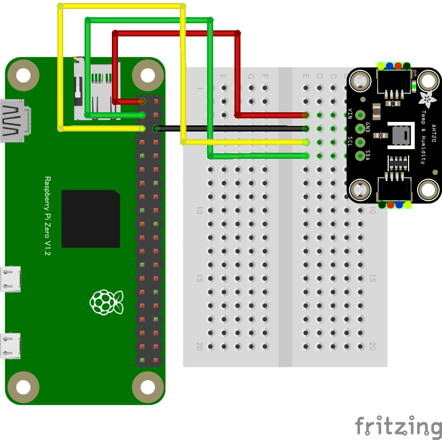

# AHT20 温湿度センサー

## 配線図



## Note: このデバイスで使用するドライバahtx0.jsは、AHT20及びAHT10で使用可能です。

## ドライバのインストール

```sh
npm i node-web-i2c @chirimen/ahtx0
```

## サンプルコード

同ディレクトリの [main.js](main.js) と同じ内容です。

```javascript
import { requestI2CAccess } from "node-web-i2c";
import AHT20 from "@chirimen/ahtx0";
const sleep = (msec) => new Promise((resolve) => setTimeout(resolve, msec));

const i2cAccess = await requestI2CAccess();
const i2cPort = i2cAccess.ports.get(1);
const aht20 = new AHT20(i2cPort, 0x38);
await aht20.init();

while (true) {
  const { humidity, temperature } = await aht20.readData();
  console.log(
    [
      `Humidity: ${humidity.toFixed(2)}%`,
      `Temperature: ${temperature.toFixed(2)} degree`,
    ].join(", "),
  );

  await sleep(500);
}
```
