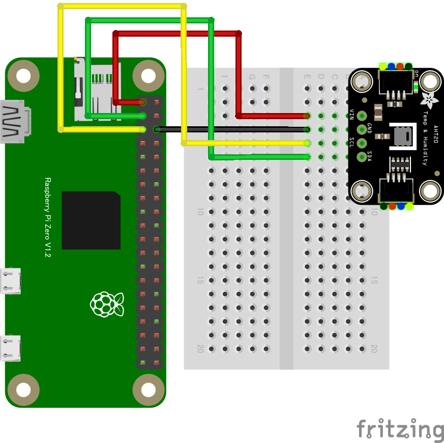

# AHT20 温湿度センサー

## 配線図



# ドライバのインストール

```
npm i @chirimen/ahtx0
```
## Note: このドライバ(ahtx0)は、AHT10及びAHT20両方で使用可能です。

# サンプルコード

```javascript
const { requestI2CAccess } = require("node-web-i2c");
const AHT20 = require("@chirimen/ahtx0");
const { promisify } = require("util");
const sleep = promisify(setTimeout);

main();

async function main() {
  const i2cAccess = await requestI2CAccess();
  const port = i2cAccess.ports.get(1);
  const aht20 = new AHT20(port, 0x38);
  await aht20.init();

  while (true) {
    const { humidity, temperature } = await aht20.readData();
    console.log(
      [
        `Humidity: ${humidity.toFixed(2)}%`,
        `Temperature: ${temperature.toFixed(2)} degree`
      ].join(", ")
    );

    await sleep(500);
  }
}
```

