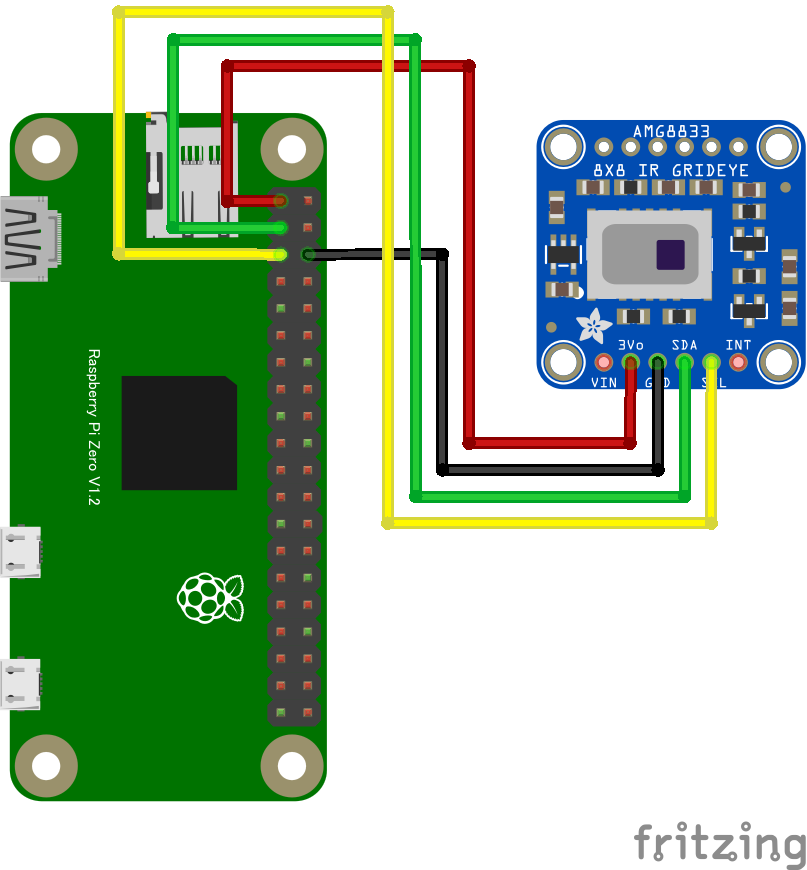

# AMG8833 サーモグラフィー

## 配線図



## ドライバのインストール

```sh
npm i node-web-i2c @chirimen/amg8833
```

## サンプルコード

同ディレクトリの [main.js](main.js) と同じ内容です。

```javascript
import { requestI2CAccess } from "node-web-i2c";
import AMG8833 from "@chirimen/amg8833";
const sleep = (msec) => new Promise((resolve) => setTimeout(resolve, msec));

const i2cAccess = await requestI2CAccess();
const i2cPort = i2cAccess.ports.get(1);
const amg8833 = new AMG8833(i2cPort, 0x69);
await amg8833.init();

while (true) {
  const data = await amg8833.readData();
  for (const row of data) {
    // degree Celsius
    console.log(row.map((value) => value.toFixed(2)).join(" "));
  }

  console.log();
  await sleep(500);
}
```
