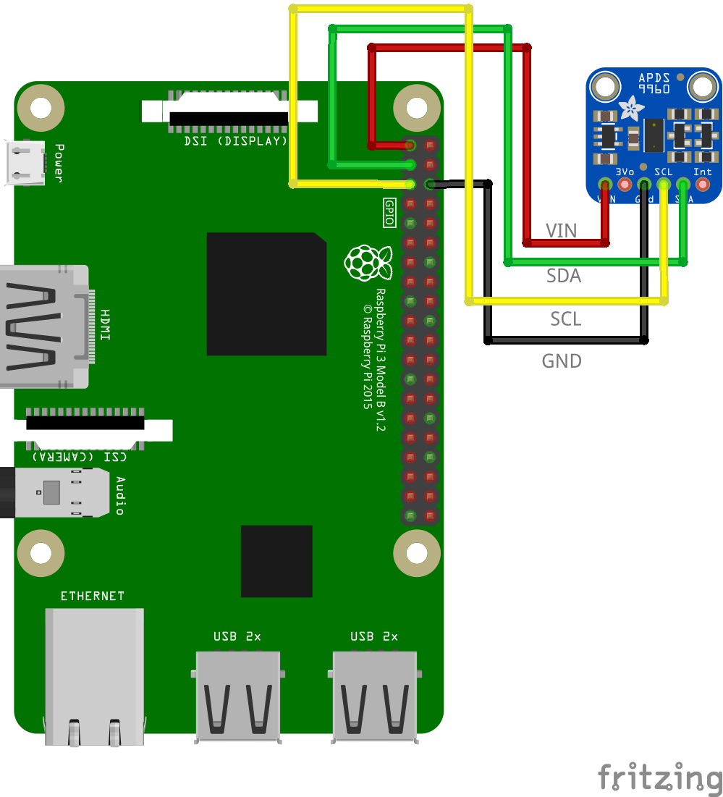

# APDS9960 近接・環境光・ジェスチャーセンサー

## 配線図



VCC(3.3V)・GND・SDA・SCL の4本をRaspberry PiのI2Cピンに接続します。I2Cアドレスは `0x39` 固定です。

## ドライバのインストール

```sh
npm i node-web-i2c @chirimen/apds9960
```

## サンプルコード

同ディレクトリの [main.js](main.js) と同じ内容です。

```javascript
import { requestI2CAccess } from "node-web-i2c";
import APDS9960 from "@chirimen/apds9960";
const sleep = (ms) => new Promise((resolve) => setTimeout(resolve, ms));

const i2cAccess = await requestI2CAccess();
const apds9960 = new APDS9960(i2cAccess.ports.get(1));
await apds9960.init();
await apds9960.enableLightSensor(false);
await apds9960.enableProximitySensor(false);
await apds9960.enableGestureSensor(false);

while (true) {
  if (await apds9960.isGestureAvailable()) {
    const gesture = await apds9960.readGesture();
    console.log("ジェスチャー検出:", gesture);
  }
  const lux = await apds9960.readAmbientLight();
  const proximity = await apds9960.readProximity();
  console.log(`照度: ${lux}, 近接: ${proximity}`);
  await sleep(500);
}
```

Note: APDS9960はAPDS9930の上位互換的なセンサーで、近接・環境光に加えて手などの動き(上下左右)を検出するジェスチャー機能を備えています。センサーの真上、数cm〜10cm程度の範囲で手を動かすとジェスチャーとして検出されます。
