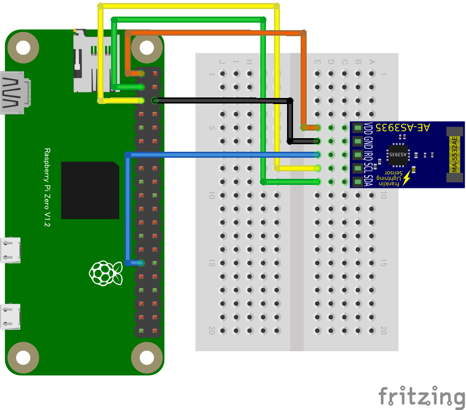

# AS3935 雷センサー

## 概要
AS3935は、雷センサーICです。ICに内蔵された雷検出アルゴリズムが入力信号をチェックし暴風雨の頭部までの距離を推定します。

このサンプルでは、I2Cバスに加えて、GPIOポート5を雷検出のトリガーとして使用しています。

## 特記事項
しっかりと動作確認ができていません。（雷検出の機会が少ないため）　動作確認にご協力ください。（ISSUEにレポートを記載いただけると幸いです）

## 使用するブレークアウトボード

- I2Cスレーブアドレス、```0x03```が設定されているものを使用しています。
- 秋月電子通商 AE-AS3935 がこれに相当します。: [製品ページ](https://akizukidenshi.com/catalog/g/gK-08685/)　

## I2Cデバイスの検出

- I2Cアドレス ```0x03```のデバイスは、通常のi2cdetectコマンドでは検出できません（標準範囲外アドレス） ```-a``` オプションが必要です。コマンドプロンプトから、以下のコマンドで検出してください。
- ```i2cdetect -y -a 1```

## 配線図


