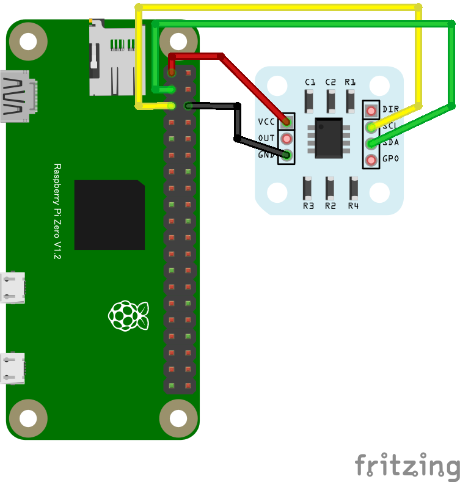
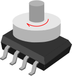

## 磁気式角度センサ AS5600を使う

ブレークアウトボードを購入すると付属している円盤状の磁石をチップに近接配置。この磁石の回転角を非接触で検出できるセンサです
* 円盤状磁石の中心を回転軸とし、この角度を検出
* チップの中心と、円盤状磁石の中心を一致させる
* チップ表面と磁石の距離は0.5～3mm程度にする ([参照情報(データシート33ページ)](https://ams.com/documents/20143/36005/AS5600_DS000365_5-00.pdf#page=34))
* DIRピンをVCCに接続すると角度の方向が逆向きになる
* ブレークアウトボード
  * https://electronicwork.shop/items/64205dc6cd92fe0096fb7d5c
  * https://www.switch-science.com/products/3493

* ソフトウェア
  * [as5600.js](as5600.js) : ドライバ
  * [main-as5600.js](main-as5600.js) : サンプルアプリ
  * 両方ともmyAppディレクトリ直下に置く

* AS5600データシート
  * https://ams.com/documents/20143/36005/AS5600_DS000365_5-00.pdf

