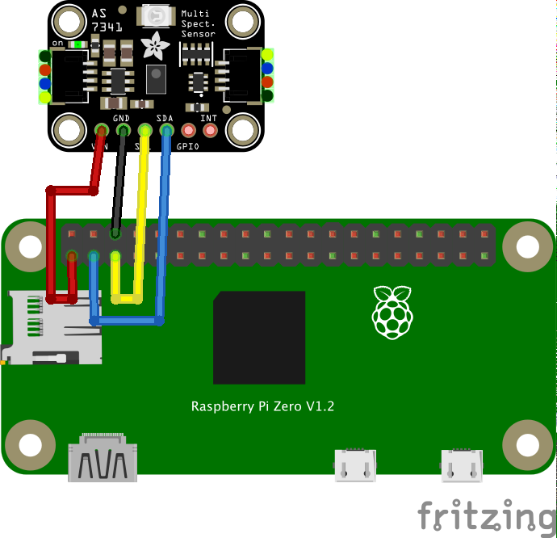

# AS7341 分光カラーセンサー

## センサー仕様
- ams-OSRAM製 11チャンネル分光カラーセンサー
- 測定チャンネル：F1〜F8（415 nm〜680 nm の可視光8チャンネル）、Clear（全可視光）、NIR（近赤外）
- 電源：3.3 V
- I2Cアドレス：0x39（固定）
- 配線：VIN（3.3 V）・GND・SDA・SCL の4本をRaspberry PiのI2C端子に接続する
- 測定時間（ATIME / ASTEP）とゲイン（0.5倍〜512倍）を設定可能
- init()実行時にデフォルトの測定条件（ATIME=100、ASTEP=999、ゲイン=256倍）が設定される。
  明るい環境で値が飽和する場合は setGain() でゲインを下げて調整する

## 配線図



## ドライバのインストール

```
npm i @chirimen/as7341
```

## ファイル説明
- AS7341.fzpz  
AS7341センサーのパーツファイル  
対応APP：Fritzing

- AS7341.fzz  
配線図のファイル  
対応APP：Fritzing

- AS7341.svg  
配線図のベクター形式画像

## サンプルコード説明

I2Cアドレス0x39でインスタンスを作成
```
new AS7341(i2cPort, 0x39);
```

センサーの初期化  
チップIDの確認・電源ONの後、測定条件のデフォルト値（ATIME=100、ASTEP=999、ゲイン=256倍）を設定する
```
await as7341.init();
```

積分時間パラメータATIMEを設定（0〜255）
```
await as7341.setATIME(100);
```

積分ステップ時間パラメータASTEPを設定（0〜65534）
```
await as7341.setASTEP(999);
```

ADCのゲイン（倍率）を設定  
指定できる値は 0.5, 1, 2, 4, 8, 16, 32, 64, 128, 256, 512 のいずれか
```
await as7341.setGain(256);
```

全チャンネルの測定を実行し、結果をオブジェクトで取得  
f1〜f8（各波長の強度）、clear（全可視光）、nir（近赤外）が得られる
```
await as7341.read();
```

## 参考URL
- 本サンプルコードで使用しているドライバ  
[@chirimen/as7341](https://www.jsdelivr.com/package/npm/@chirimen/as7341)

- センサーの製品ページ  
https://akizukidenshi.com/catalog/g/g131479/

- 参考元のドライバのコード  
https://github.com/adafruit/Adafruit_AS7341
