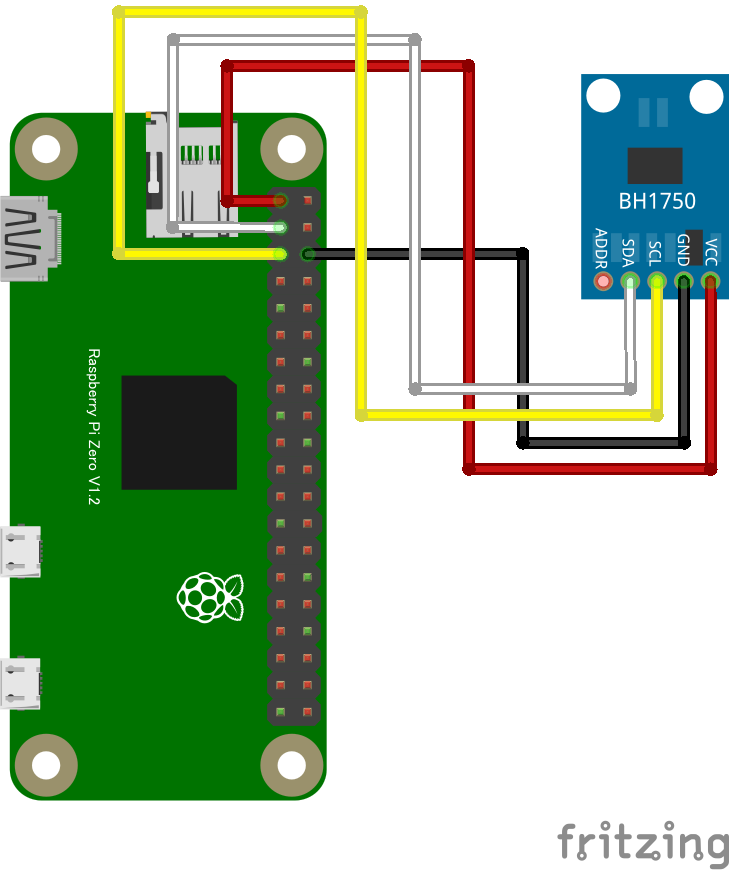

# BH1750 光センサー

## 配線図



## ドライバのインストール

```sh
npm i node-web-i2c @chirimen/bh1750
```

## サンプルコード

同ディレクトリの [main.js](main.js) と同じ内容です。

```javascript
import { requestI2CAccess } from "node-web-i2c";
import BH1750 from "@chirimen/bh1750";
const sleep = (msec) => new Promise((resolve) => setTimeout(resolve, msec));

const i2cAccess = await requestI2CAccess();
const i2cPort = i2cAccess.ports.get(1);
const bh1750 = new BH1750(i2cPort, 0x23);
await bh1750.init();

while (true) {
  const lux = await bh1750.measure_high_res();
  console.log(lux.toFixed(3) + "lx");

  await sleep(500);
}
```
