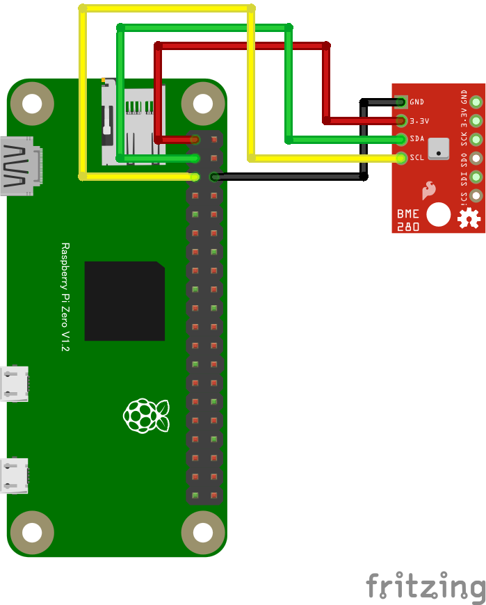

# BME280 温度・湿度・気圧センサー

## 配線図



## ドライバのインストール

```sh
npm i node-web-i2c @chirimen/bme280
```

## サンプルコード

同ディレクトリの [main.js](main.js) と同じ内容です。

```javascript
import { requestI2CAccess } from "node-web-i2c";
import BME280 from "@chirimen/bme280";
const sleep = (msec) => new Promise((resolve) => setTimeout(resolve, msec));

const i2cAccess = await requestI2CAccess();
const i2cPort = i2cAccess.ports.get(1);
const bme280 = new BME280(i2cPort, 0x76);
await bme280.init();

while (true) {
  const data = await bme280.readData();
  const temperature = data.temperature.toFixed(2);
  const humidity = data.humidity.toFixed(2);
  const pressure = data.pressure.toFixed(2);
  console.log(
    [
      `Temperature: ${temperature} degree`,
      `Humidity: ${humidity} %`,
      `Pressure: ${pressure} hPa`,
    ].join(", "),
  );
  await sleep(500);
}
```
