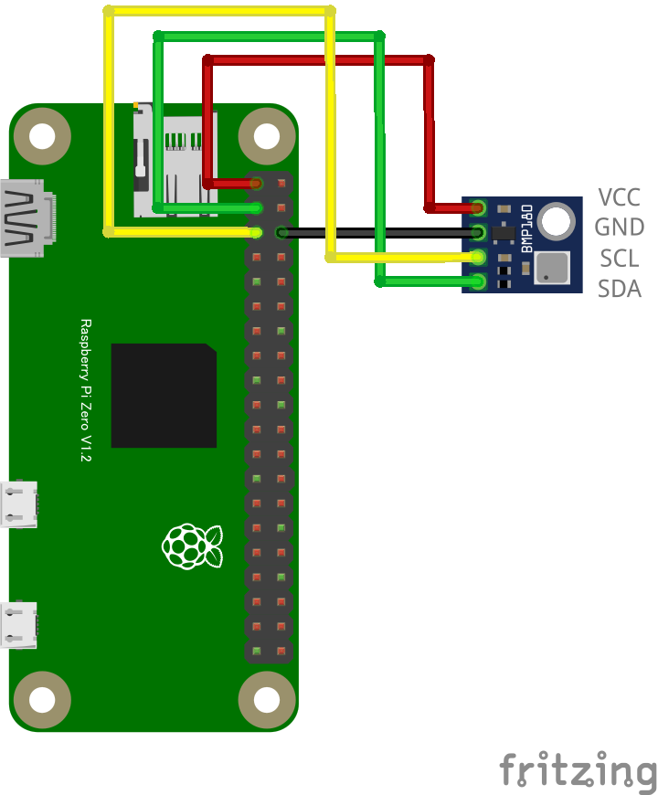

# BMP280 温度・気圧センサー

## 配線図



## ドライバのインストール

```sh
npm i node-web-i2c @chirimen/bmp280
```

## サンプルコード

同ディレクトリの [main.js](main.js) と同じ内容です。

```javascript
import { requestI2CAccess } from "node-web-i2c";
import BMP280 from "@chirimen/bmp280";
const sleep = (msec) => new Promise((resolve) => setTimeout(resolve, msec));

const i2cAccess = await requestI2CAccess();
const i2cPort = i2cAccess.ports.get(1);
const bmp280 = new BMP280(i2cPort, 0x76);
await bmp280.init();

while (true) {
  const data = await bmp280.readData();
  const pressure = data.pressure.toFixed(2);
  const temperature = data.temperature.toFixed(2);
  console.log(
    [`Temperature: ${temperature} degree`, `Pressure: ${pressure} hPa`].join(
      ", ",
    ),
  );

  await sleep(500);
}
```
