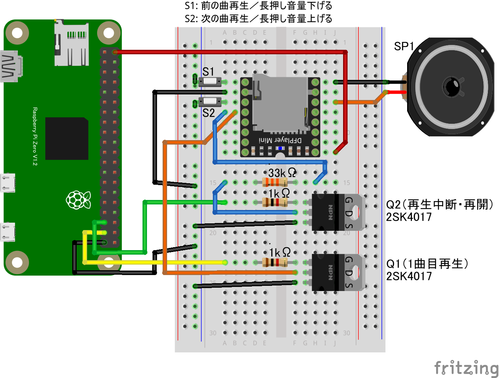

# DFPlayer Mini(MP3プレーヤーボードをGPIO OUTPUTで制御)

## 配線図

* DFPlayer MiniボードのADKEY1端子をNchMOSFETを介してGPIOで制御します
(他にシリアル通信での制御も可能なボードですがこのサンプルはGPIOで制御できるADKEY端子を使用)
* 電源投入後、ボリュームが最大になるのでS1スイッチは付けておきましょう
* ADKEY1/2端子と抵抗を組み合わせることでいろいろなコントロールが可能です。GPIO端子の使用数を増やすと制御できる種類も増やせます。[こちらのページ](https://chitakekoubou.blogspot.com/p/dfplayeradkeyio.html)や、[メーカーサイトの説明ページ](https://wiki.dfrobot.com/DFPlayer_Mini_SKU_DFR0299)を参考に