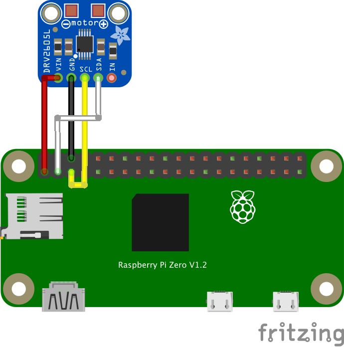

# DRV2605L

DRV2605Lを使用して、I2C経由でERM振動モーターを振動させるサンプルです。

## 使用するデバイス

- Raspberry Pi Zero 2 W
- DRV2605L ハプティックモータードライバ
- ERM振動モーター

## I2Cアドレス

DRV2605LのデフォルトI2Cアドレスは `0x5A` です。

## 配線

Raspberry PiとDRV2605LをI2Cで接続します。

| Raspberry Pi | DRV2605L |
| ------------ | -------- |
| 3.3V         | VIN      |
| GND          | GND      |
| SDA          | SDA      |
| SCL          | SCL      |

振動モーターはDRV2605Lのモーター出力端子に接続します。

| DRV2605L | 振動モーター |
| -------- | ------------ |
| MOTOR+   | +            |
| MOTOR-   | -            |

## 配線図



## ファイル説明

### DRV2605L.fzz

Fritzingで編集できるDRV2605Lの配線図ファイルです。

### DRV2605L.svg

DRV2605Lの配線図に使用したSVGファイルです。

### DRV2605L.fzpz

FritzingでDRV2605Lを使用するためのパーツファイルです。

## 実行方法

依存パッケージをインストールします。

```bash
npm install
```

サンプルを実行します。

```bash
node main.js
```

## サンプルの動作

DRV2605Lを初期化したあと、Real-Time Playback (RTP) モードを使用して振動モーターを動作させます。

このサンプルでは、振動強度 `80`、振動時間 `400` ミリ秒でモーターを振動させます。

```js
await motor.vibrate(80, 400);
```

`vibrate()` の第1引数には `0` から `127` の振動強度、第2引数には振動時間をミリ秒単位で指定します。

## ドライバ

このサンプルでは `@chirimen/drv2605l` を使用します。
