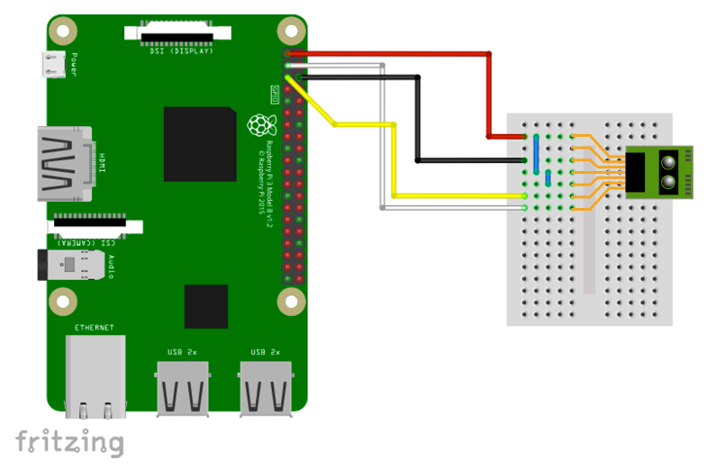

# GP2Y0E03 測距センサー 40 mm - 0.1 m

## 配線図



## ドライバのインストール

```sh
npm i node-web-i2c @chirimen/gp2y0e03
```

## サンプルコード

同ディレクトリの [main.js](main.js) と同じ内容です。

```javascript
import { requestI2CAccess } from "node-web-i2c";
import GP2Y0E03 from "@chirimen/gp2y0e03";
const sleep = (msec) => new Promise((resolve) => setTimeout(resolve, msec));

try {
  const i2cAccess = await requestI2CAccess();
  const i2cPort = i2cAccess.ports.get(1);
  const sensor_unit = new GP2Y0E03(i2cPort, 0x40);
  await sensor_unit.init();

  while (1) {
    try {
      const distance = await sensor_unit.read();
      if (distance != null) {
        console.log("Distance:" + distance + "cm");
      } else {
        console.log("out of range");
      }
    } catch (err) {
      console.error("READ ERROR:" + err);
    }
    await sleep(500);
  }
} catch (err) {
  console.error("GP2Y0E03 init error");
}
```
