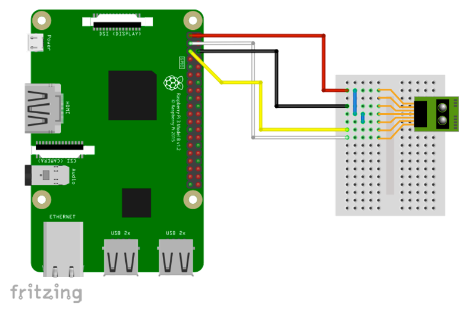

# GP2Y0E03 測距センサー 40 mm - 0.1 m

## 配線図



## ドライバのインストール

```sh
npm i node-web-i2c @chirimen/gp2y0e03
```

## サンプルコード

同ディレクトリの [main.js](main.js) と同じ内容です。

```javascript
import { requestI2CAccess } from "node-web-i2c";
import GP2Y0E03 from "@chirimen/gp2y0e03";
const sleep = (ms) => new Promise((resolve) => setTimeout(resolve, ms));

const i2cAccess = await requestI2CAccess();
const gp2y0e03 = new GP2Y0E03(i2cAccess.ports.get(1), 0x40);
await gp2y0e03.init();

while (true) {
  const distance = await gp2y0e03.read();
  if (distance != null) {
    console.log("Distance:" + distance + "cm");
  } else {
    console.log("out of range");
  }
  await sleep(500);
}
```
