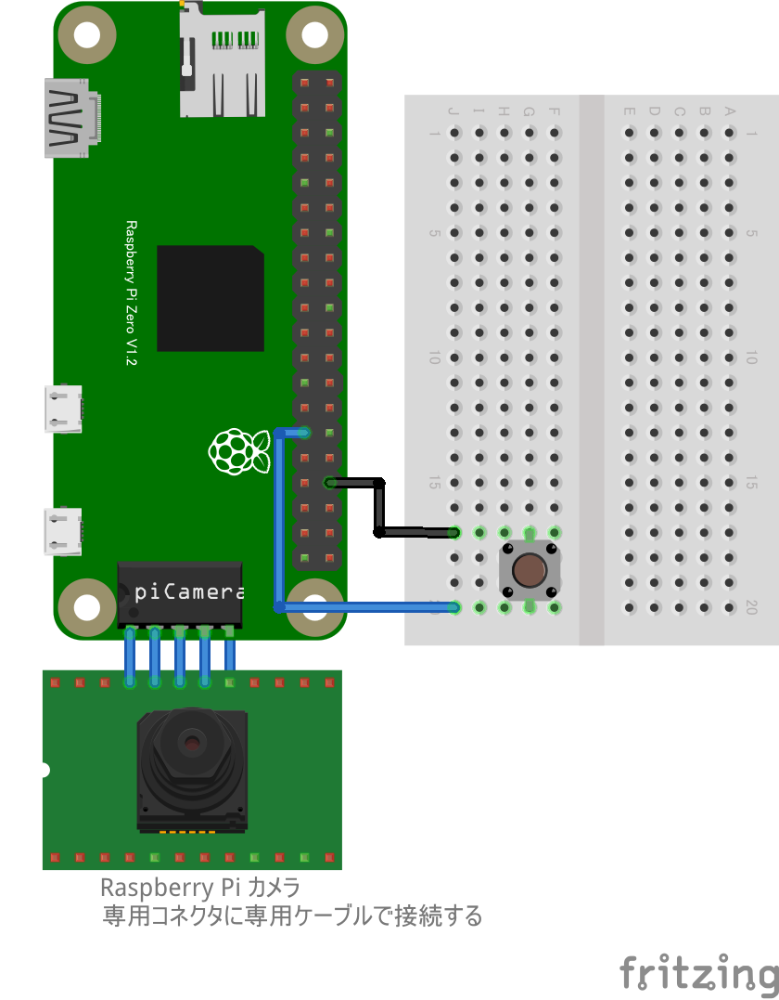

# GPIO スイッチによるカメラ撮影 (GPIO-Camera)

## 配線図



タクトスイッチは GPIO PORT5 に繋ぎます。

カメラは専用コネクターに専用ケーブルを使って接続し、更にセットアップが必要です。次章を参照してください

# カメラのセットアップと動作確認

_この章は[こちらの記事の再掲](https://gist.github.com/satakagi/1b5adc8dff8236421a593b93fa152222)です。_

[Raspberry Pi のカメラ](https://www.raspberrypi.com/documentation/accessories/camera.html)を API で直接操作する[pi-camera-connect](https://www.npmjs.com/package/pi-camera-connect)を使った方法です。[Pi-Camera](https://github.com/stetsmando/pi-camera)を使った方法([gist はこちら](https://gist.github.com/satakagi/2c5be63d4759fd21eca939f507e7f7ef))より、大幅に高速に画像が取得できることを確認しています。

## 準備

- Raspberry Pi カメラモジュール (最新の純正モジュール(v3)は今のところ非対応です)
  - [例 1:KEYESTUDIO カメラモジュール](https://www.amazon.co.jp/dp/B073RCXGQS/)、[例 2](https://www.amazon.co.jp/dp/B086MK17K5/)、[例 3](https://www.amazon.co.jp/dp/B08HVRB59N/)
- Zero 用ケーブル～上のモジュールは添付されているようです。
  - 無い場合は [別途調達](https://www.amazon.co.jp/gp/product/B07QH455KY/)
- [接続のしかた](https://projects.raspberrypi.org/ja-JP/projects/getting-started-with-picamera) : Zero は専用ケーブルでつなぎます

## セットアップ

コマンドプロンプトで、以下設定

- sudo raspi-config
  - Interface Option ⇒ P1 Legacy Camera ⇒ ＜はい＞ ⇒ ＜了解＞ ⇒ ＜ Finish ＞ (カーソルキーと Enter キーと TAB キーで操作)
  - 参考：[この情報を参考に](https://www.rs-online.com/designspark/raspberry-pi-camera-jp)
- カメラ単体テスト
  - vcgencmd get_camera
    - 出力：supported=1 detected=1
  - raspistill -v -w 640 -h 480 -o test.jpg
    - 出力：カメラの情報、画像ファイル保存
- cd ~/myApp
- npm install pi-camera-connect

## サンプル

[pi-camera-connect のリポジトリ](https://github.com/launchcodedev/pi-camera-connect)の readme と同じ内容ですが、オプションを加えてみました

```javascript
import { StillCamera } from "pi-camera-connect";
import * as fs from "fs";

// Take still image and save to disk
async function runApp() {
  const stillCamera = new StillCamera({
    width: 600,
    height: 600,
  });
  const image = await stillCamera.takeImage();
  fs.writeFileSync("still-image.jpg", image);
}

runApp();
```

dataURL を取得

```javascript
import { StillCamera } from "pi-camera-connect";

// Take still image and get dataURI
async function runApp() {
  const stillCamera = new StillCamera({
    width: 200,
    height: 200,
  });
  var mime = "image/jpeg";
  var encoding = "base64";
  const image = await stillCamera.takeImage();
  const b64str = image.toString(encoding);
  const dataURL = "data:" + mime + ";" + encoding + "," + b64str;
  console.log(dataURL);
}

runApp();
```

## Note

- [dataURL](https://developer.mozilla.org/ja/docs/Web/HTTP/Basics_of_HTTP/Data_URIs)で画像を文字列化すれば比較的簡単にサーバに送信したりできるでしょう。
  - [リモートカメラサンプル](https://tutorial.chirimen.org/pizero/esm-examples/#REMOTE_remote_camera)
- 各種センサ (WebGPIO 経由で人感センサーなど)を使い、自動的に撮影、サーバにアップロードする仕組みなどもできるでしょう。
- [pi-camera-connect のリポジトリ](https://github.com/launchcodedev/pi-camera-connect)
