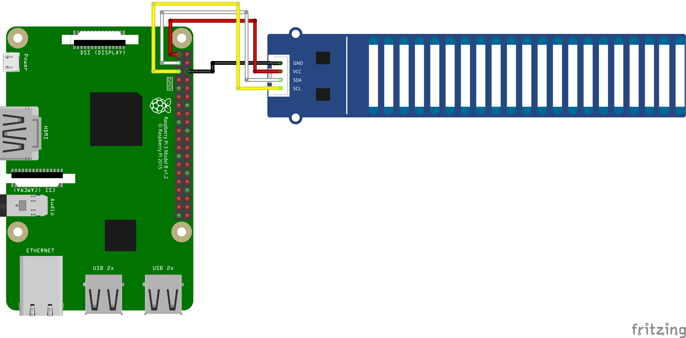

# GroveWaterLevelSensor 水位センサー

## センサー仕様
- 2 x 8-bit ATTINY1616 MCU
- 電源：3.3 V / 5 V
- 測定精度：±5 mm
- I2Cアドレス：0x78および0x77（同時使用）
- 動作温度範囲：-40〜105°C
- 重さ：9.8 g
- 寸法：20 x 133 mm

## 配線図



## ドライバのインストール

```
npm i @chirimen/grove-water-level-sensor
```

## ファイル説明
- groveWaterLevelSensor.ai  
配線図で使用している簡易的な水位センサーのベクター形式画像  
対応APP：Adobe Illustrator（ver.29.6.1）

- GroveWaterLevelSensor.fzpz  
水位センサーのパーツファイル  
対応APP：Fritzing（ver.0.9.5）

- GroveWaterLevelSensor.fzz  
配線図のファイル  
対応APP：Fritzing（ver.0.9.5）

- groveWaterLevelSensor.svg  
groveWaterLevelSensor.aiからエクスポートしたSVGファイル  
対応APP：Adobe Illustrator（ver.29.6.1）

## サンプルコード説明

水位センサーのデフォルトアドレスの0x77と0x78でインスタンスを作成  
本センサーは上部と下部でアドレスが分かれており、下部8個のセンサー部のデータは0x77、上部12個のセンサー部のデータは0x78から取得できる
```
new WaterLevelSensor(i2cPort, 0x77, 0x78);
```

センサーの初期化
```
await waterlevelsensor.init();
```

水位センサーの上位12セクションの検知した静電容量値を配列で取得  
各センサー部が水に触れているかどうかを検出するために使用する  
あくまで水位の有無や変化を検出するための指標のため単位は無い
```
await waterlevelsensor.getHigh12SectionValue();
```

水位センサーの下位8セクションの検知した静電容量値を配列で取得  
各センサー部が水に触れているかどうかを検出するために使用する  
あくまで水位の有無や変化を検出するための指標のため単位は無い
```
await waterlevelsensor.getLow8SectionValue();
```

現在の水位を取得  
0〜100の間で5刻みで取得できる  
出力単位は「%」
```
await waterlevelsensor.getWaterLevel();
```

## 参考URL
- 本サンプルコードで使用しているドライバ  
[@chirimen/grove-water-level-sensor](https://www.jsdelivr.com/package/npm/@chirimen/grove-water-level-sensor)

- センサーの製品ページ  
https://www.switch-science.com/products/6282

- 参考元のドライバのコード  
https://github.com/SeeedDocument/Grove-Water-Level-Sensor