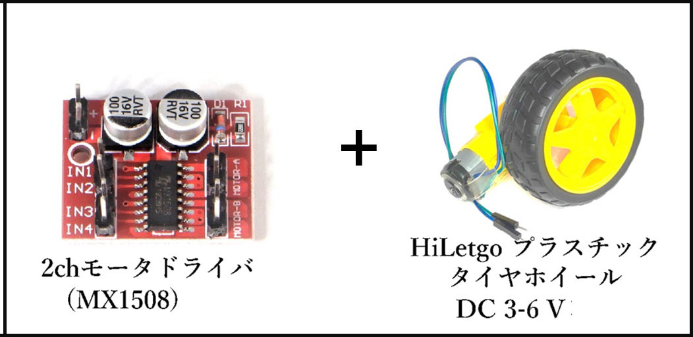
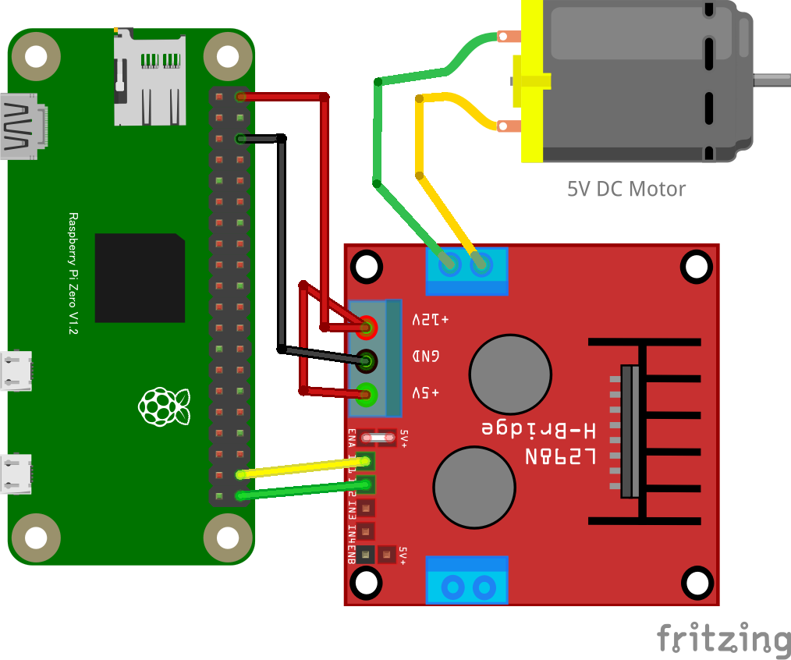

# HBridge1: DC モーター制御

MX1508 モータードライバーを使って DC モーターを制御します。
H ブリッジモータードライバは正転[1,0]・逆転[0,1]・ブレーキ[1,1]・フリー[0,0]の 4 状態を GPIO の２つの信号線を使って指示します。

## MX1508 モータードライバー

MX1508 は小型で使いやすい DC モータードライバーです。L298N と同様の機能を持ちながら、よりコンパクトで初学者にも扱いやすい特徴があります。

**主な特徴：**

- 動作電圧：2V〜10V
- 最大出力電流：1.5A
- 2 つの DC モーターを制御可能
- 正転・逆転・ブレーキ・フリーの 4 つの制御状態

## 配線図

**接続方法：**

- MX1508 の IN1 を GPIO26 に接続
- MX1508 の IN2 を GPIO19 に接続
- MX1508 の VCC を 5V に接続（モーター電源）
- MX1508 の GND を GND に接続
- モーターを MOTOR A または MOTOR B に接続

**制御信号：**

- 正転：IN1=1, IN2=0
- 逆転：IN1=0, IN2=1
- ブレーキ：IN1=1, IN2=1
- フリー：IN1=0, IN2=0

## L298N での接続について（参考）

元の配線図は L298N モータードライバーを使用した例です。L298N は定番のモータードライバーですが、MX1508 と比較すると以下の違いがあります：

**L298N 接続方法：**

- IN1 を GPIO26 に接続
- IN2 を GPIO19 に接続
- +12V をモーター電源（6V〜12V）に接続
- +5V を Raspberry Pi の 5V に接続
- GND を共通接続
- モーターを OUT1、OUT2 に接続

L298N と MX1508 は制御信号の方式は同じですが、電源系統の接続が異なります。プロジェクトの要件に応じて適切なドライバーを選択してください。
