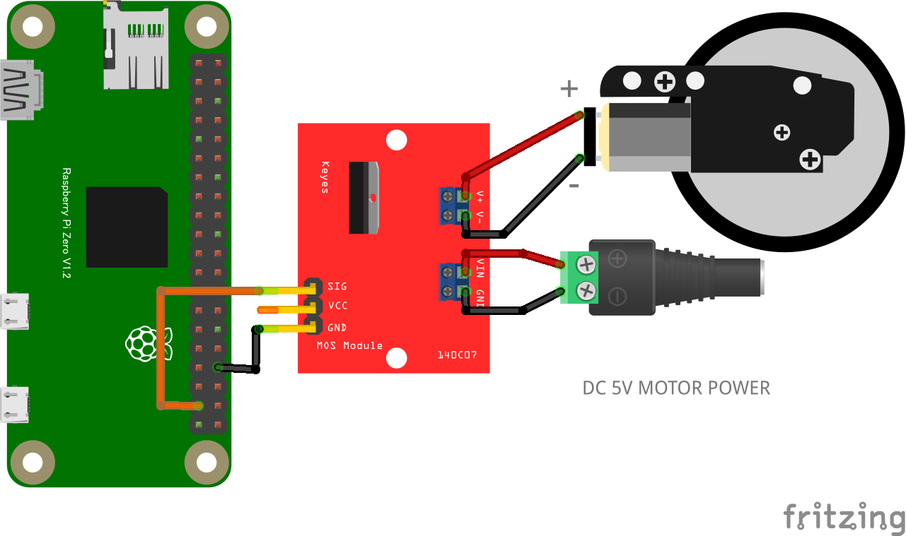

# Lチカ (GPIO OUTPUT)

## 配線図

GPIO PORT26にLED+抵抗を繋ぎます

# ギヤードモーター (GPIO OUTPUT)

## 配線図

GPIO PORT26にモーター制御回路を繋ぎます。コードはLチカと共通です

## 外部電源を使用する場合　

5V以外のDC電源も使用可能です。

## MOSFETモジュール基板を使用する場合

5V以外のDC電源も使用可能です。

# ギヤードモータ(その２)

