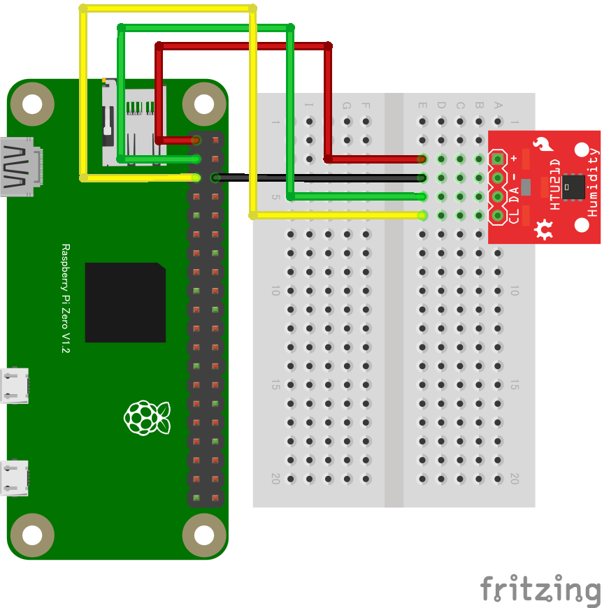

# HTU21D 温湿度センサー

## 配線図



## ドライバのインストール

```sh
npm i node-web-i2c @chirimen/htu21d
```

## サンプルコード

同ディレクトリの [main.js](main.js) と同じ内容です。

```javascript
import { requestI2CAccess } from "node-web-i2c";
import HTU21D from "@chirimen/htu21d";
const sleep = (msec) => new Promise((resolve) => setTimeout(resolve, msec));

const i2cAccess = await requestI2CAccess();
const i2cPort = i2cAccess.ports.get(1);
const htu21d = new HTU21D(i2cPort, 0x40);
await htu21d.init();

while (true) {
  const temp = await htu21d.readTemperature();
  const humi = await htu21d.readHumidity();
  console.log("Temperature:", temp, " Humidity", humi);
  await sleep(1000);
}
```
