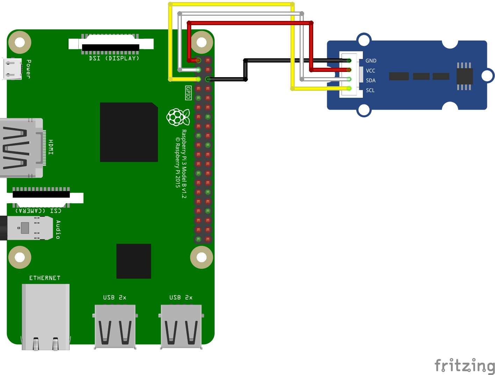

# GROVE - MCP9808搭載 I2C高精度温度センサ

- 動作電圧 :3.3V、5V
- 動作範囲 :-40°C ～ +125°C
- 分解能  :0.5°C、0.25°C、0.125°C、0.0625°C
- I2Cアドレス  :0x18 〜 0x1F（デフォルト0x18）

## 配線図



## ドライバのインストール

```
npm i @chirimen/mcp9808
```

## サンプルコード説明
```
const mcp9808 = new MCP9808(i2cPort, 0x18);
``` 
MCP9808のデフォルトアドレスである0x18でインスタンスを作成 
モジュール背面のAD0、AD1、AD2をLOW(0)側またはHIGH(1)側にはんだ付けすることで、以下のようにI2Cアドレスを変更することが可能  
||AD0|AD1|AD2|
|:---:|:---:|:---:|:---:|
|0x18|0|0|0|
|0x19|0|0|1|
|0x1A|0|1|0|
|0x1B|0|1|1|
|0x1C|1|0|0|
|0x1D|1|0|1|
|0x1E|1|1|0|
|0x1F|1|1|1|  


```
await mcp9808.setResolution(3);
```
引数に応じて、温度の分解能を設定  
|引数|分解能|サンプリング時間|
|:---:|:---:|:---:|
|**0**|0.5 °C|30 ms|
|**1**|0.25 °C|65 ms|
|**2**|0.125 °C|130 ms|
|**3**|0.0625 °C|250 ms|  


```
  let data_t = await mcp9808.readTempC();
  let data_f = await mcp9808.readTempF();
```
摂氏（readTempC）と華氏（readTempF）で温度を取得  


## 参考URL
- 本サンプルコードで使用しているドライバ  
[@chirimen/mcp9808](https://www.jsdelivr.com/package/npm/@chirimen/mcp9808)

- センサの製品ページ  
https://www.switch-science.com/products/3986

- センサの販売元ページ  
https://www.seeedstudio.com/Grove-I2C-High-Accuracy-Temperature-Sensor-MCP9808.html

