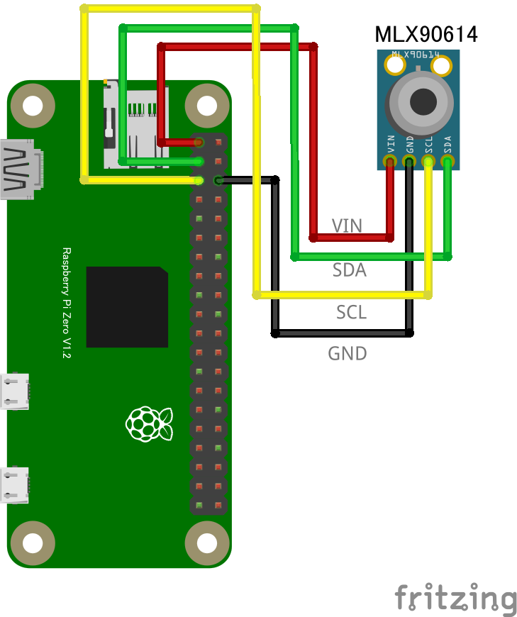

# MLX90614 赤外線温度センサー

## 配線図



## ドライバのインストール

```sh
npm i node-web-i2c @chirimen/mlx90614
```

## サンプルコード

同ディレクトリの [main.js](main.js) と同じ内容です。

```javascript
import { requestI2CAccess } from "node-web-i2c";
import MLX90614 from "@chirimen/mlx90614";
const sleep = (msec) => new Promise((resolve) => setTimeout(resolve, msec));

const i2cAccess = await requestI2CAccess();
const i2cPort = i2cAccess.ports.get(1);
const mlx90614 = new MLX90614(i2cPort, 0x5a);
await mlx90614.init();

while (true) {
  // Temperature of object that the sensor looking at. (Measured by IR sensor)
  const objectTemperature = await mlx90614.get_obj_temp();
  // Temperature measured by the chip. (The package temperature)
  const ambientTemperature = await mlx90614.get_amb_temp();
  console.log(
    [
      `Object temperature: ${objectTemperature.toFixed(2)} degree`,
      `Ambient temperature: ${ambientTemperature.toFixed(2)} degree`,
    ].join(", "),
  );

  await sleep(500);
}
```
