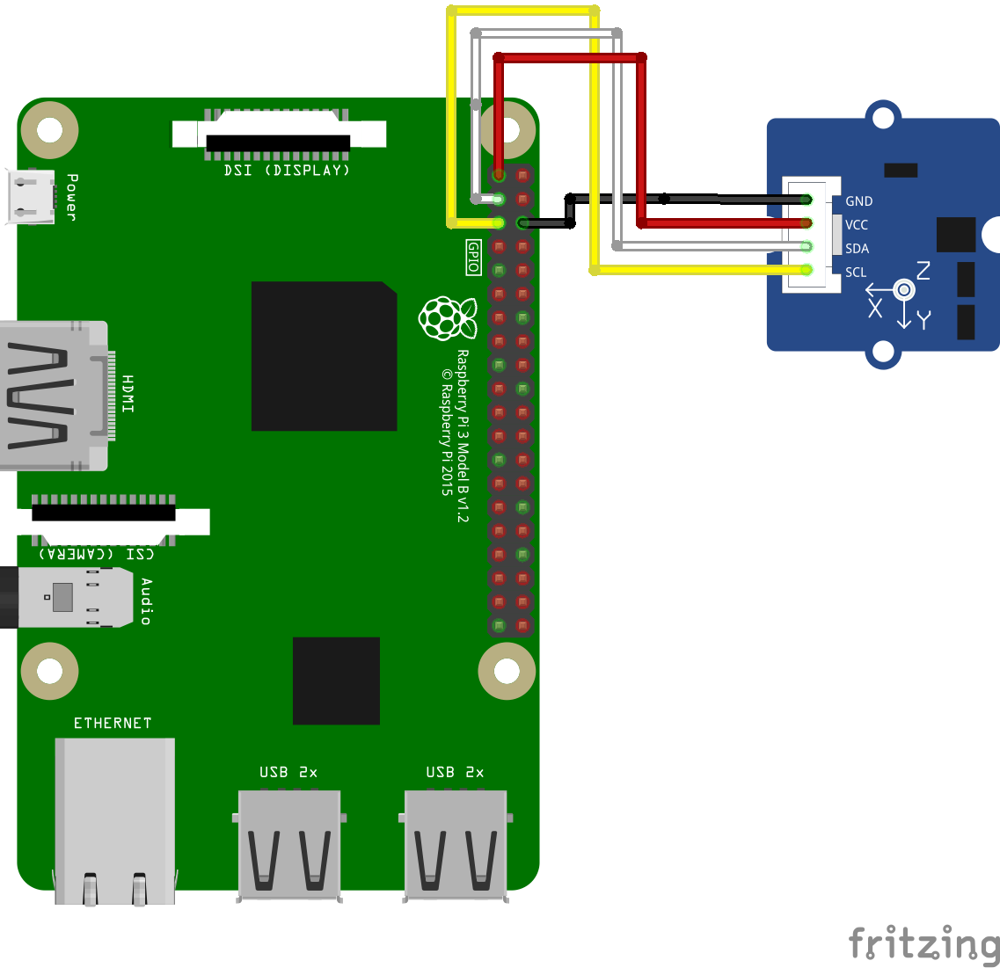

# MMA7660 ３軸加速度センサー

## 配線図



## ドライバのインストール

```
npm i @chirimen/mma7660
```

## ファイル説明
- mma7660.ai  
配線図で使用している簡易的なMMA7660のベクター形式画像
対応APP：Adobe Illustrator（ver.29.6.1）

- MMA7660.fzpz  
MMA7660のパーツファイル
対応APP：Fritzing（ver.0.9.5）

- mma7660.fzz  
配線図のファイル
対応APP：Fritzing（ver.0.9.5）

- MMA7660.svg  
mma7660.aiからエクスポートしたSVGファイル
対応APP：Adobe Illustrator（ver.29.6.1）

## サンプルコード説明

MMA7660のデフォルトアドレスの0x4cでインスタンスを作成
```
new MMA7660(i2cPort, 0x4c);
```

センサーの初期化
```
await mma7660.init();
```

X軸、Y軸、Z軸の加速度センサーの生データを取得
後述のgetAccelerationだけで加速度の検出などは可能だが、その計算元の数字を取得することができる
出力単位は「LSB/G」
```
await mma7660.getXYZ();
```

X軸、Y軸、Z軸の加速度を取得
３軸それぞれについて-1〜+1の間でデータが取得でき、定期的にデータを取得することで特定軸への傾きを検出するなどが可能
出力単位は「G」
```
await mma7660.getAcceleration();
```

## 参考URL
- 本サンプルコードで使用しているドライバ  
[@chirimen/mma7660](https://www.jsdelivr.com/package/npm/@chirimen/mma7660)

- センサーの製品ページ  
https://www.seeedstudio.com/Grove-3-Axis-Digital-Accelerometer-1-5g.html

- 参考元のドライバのコード  
https://github.com/Seeed-Studio/Accelerometer_MMA7660

