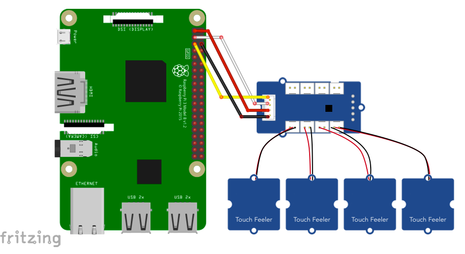

# MPR121 GROVE - I2C タッチセンサー

## 配線図



## ドライバのインストール

```sh
npm i node-web-i2c @chirimen/grove-touch
```

## サンプルコード

同ディレクトリの [main.js](main.js) と同じ内容です。

```javascript
import { requestI2CAccess } from "node-web-i2c";
import GroveTouch from "@chirimen/grove-touch";
const sleep = (msec) => new Promise((resolve) => setTimeout(resolve, msec));

const i2cAccess = await requestI2CAccess();
const i2cPort = i2cAccess.ports.get(1);
const touchSensor = new GroveTouch(i2cPort, 0x5a);
await touchSensor.init();
while (true) {
  const ch = await touchSensor.read();
  console.log(JSON.stringify(ch));
  await sleep(100);
}
```
