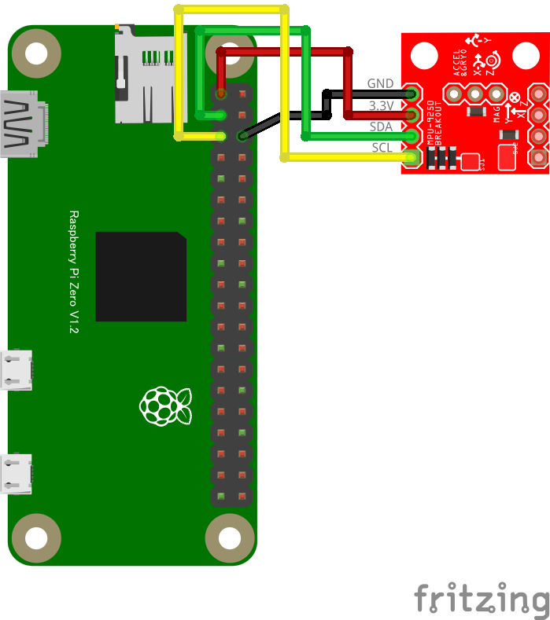

# MPU9250 ３軸ジャイロ＋３軸加速度＋３軸磁気 複合センサー

## 配線図



## ドライバのインストール

```sh
npm i node-web-i2c @chirimen/ak8963 @chirimen/mpu6500
```

## サンプルコード

同ディレクトリの [main.js](main.js) と同じ内容です。

```javascript
import { requestI2CAccess } from "node-web-i2c";
import MPU6500 from "@chirimen/mpu6500";
import AK8963 from "@chirimen/ak8963";
const sleep = (msec) => new Promise((resolve) => setTimeout(resolve, msec));

const i2cAccess = await requestI2CAccess();
const i2cPort = i2cAccess.ports.get(1);
const mpu6500 = new MPU6500(i2cPort, 0x68);
const ak8963 = new AK8963(i2cPort, 0x0c);
await mpu6500.init();
await ak8963.init();

while (true) {
  const g = await mpu6500.getGyro();
  const r = await mpu6500.getAcceleration();
  const h = await ak8963.readData();
  console.log(
    [
      `Gx: ${g.x}, Gy: ${g.y}, Gz: ${g.z}`,
      `Rx: ${r.x}, Ry: ${r.y}, Rz: ${r.z}`,
      `Hx: ${h.x}, Hy: ${h.y}, Hz: ${h.z}`,
    ].join("\n"),
  );

  await sleep(500);
}
```
