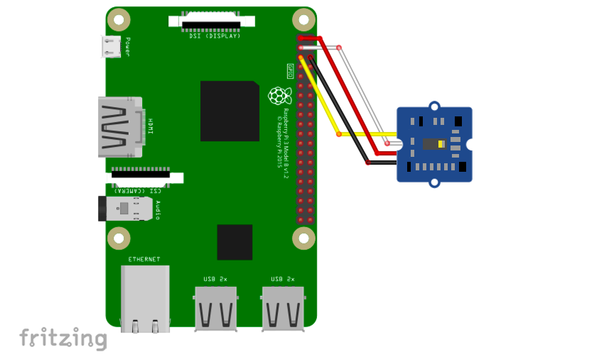

# PAJ7620 Grove Gesture ジェスチャー認識センサー

## 配線図



## ドライバのインストール

```sh
npm i node-web-i2c @chirimen/grove-gesture
```

## サンプルコード

同ディレクトリの [main.js](main.js) と同じ内容です。

```javascript
import { requestI2CAccess } from "node-web-i2c";
import PAJ7620 from "@chirimen/grove-gesture";
const sleep = (msec) => new Promise((resolve) => setTimeout(resolve, msec));

const i2cAccess = await requestI2CAccess();
const i2cPort = i2cAccess.ports.get(1);
const gesture = new PAJ7620(i2cPort, 0x73);
await gesture.init();

while (true) {
  const v = await gesture.read();
  console.log(v);
  await sleep(1000);
}
```
