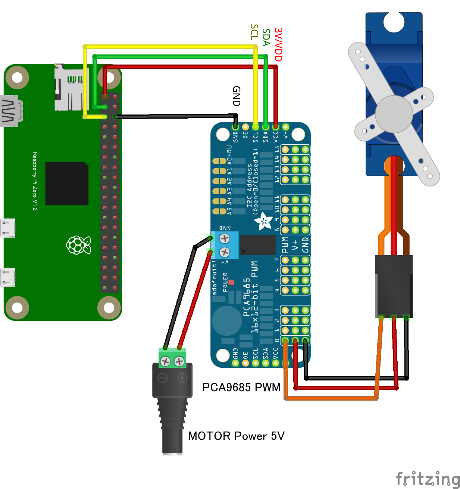

# PCA9685 16 チャンネルサーボモーター PWM ドライバー

## 配線図



## Chirimen PCA9685ドライバ補足説明書: `init`関数の引数

このドキュメントは、Chirimen環境で使用される _PCA9685_ ドライバの初期化関数 init の引数について、詳細な補足説明を提供します。

`javascript init: function(minPulse, maxPulse, angleRange, noSetZero)`

---

### init 関数の引数説明

| 引数名       | 説明                 | 単位     | デフォルト値 | 補足事項                                                                                |
| :----------- | :------------------- | :------- | :----------- | :-------------------------------------------------------------------------------------- |
| _minPulse_   | _最小パルス幅_       | sec (秒) | 0.0011       | サーボが到達できる最小角度に対応するパルス幅。                                          |
| _maxPulse_   | _最大パルス幅_       | sec (秒) | 0.0019       | サーボが到達できる最大角度に対応するパルス幅。                                          |
| _angleRange_ | _±最大回転角_        | deg (度) | 30           | 中央値からの、minPulse/maxPulse 設定時の ± 回転角。_角度指示のずれ_ に影響 (次項参照)。 |
| _noSetZero_  | _初期位置設定の有無_ | -        | false        | init 実行時にサーボを中央値 (0[deg]) にセット*しない*場合は true を設定。               |

- minPulse, maxPulse, angleRange は使用するサーボモーターによって異なります。
- 一般的なサーボの目安: minPulse: 0.001 [sec], maxPulse: 0.002 [sec], angleRange: ± 60 [deg]

---

### 設定値のカスタマイズと注意事項

#### 1. minPulse と maxPulse について（_物理破損_ の注意）

- _物理的な破損のリスク_:
  - minPulse を _過小_ に、maxPulse を _過大_ に設定すると、サーボモーターが規定の動作範囲を超えて回転しようとし、_物理的に破損_ する可能性があります。
  - _デフォルト値_ (0.0011, 0.0019) は、_安全性を考慮_ して設定されています。値を調整する際は、_サーボの仕様書_ を確認し、慎重に行ってください。

#### 2. angleRange について（_角度指示のずれ_ の注意）

- angleRange は、_PCA9685ドライバが角度指示をパルス幅に換算する際の計算係数_ です。
- この値がサーボの実際の最大回転角と異なっていても、_サーボモーターが物理的に破損することはありません_。
- ただし、angleRange を誤って設定すると、プログラムで $45[\text{deg}]$ と指示しても、サーボの実際の回転角度が $45[\text{deg}]$ から*ずれてしまう* 点に注意が必要です。

---

### 参考情報

サーボモーターのパルス幅と角度の関係についての一般的な情報は、以下のリンクなども参照してください。

- http://mycom1.cocolog-nifty.com/blog/2010/07/rc-83ee.html

## ドライバのインストール

```sh
npm i node-web-i2c @chirimen/pca9685
```

## サンプルコード

同ディレクトリの [main.js](main.js) と同じ内容です。

```javascript
import { requestI2CAccess } from "node-web-i2c";
import PCA9685 from "@chirimen/pca9685";
const sleep = (msec) => new Promise((resolve) => setTimeout(resolve, msec));

const i2cAccess = await requestI2CAccess();
const i2cPort = i2cAccess.ports.get(1);
const pca9685 = new PCA9685(i2cPort, 0x40);
// servo setting for sg90
// Servo PWM pulse: min=0.0011[sec], max=0.0019[sec] angle=+-60[deg]
await pca9685.init(0.001, 0.002, 30);
while (true) {
  await pca9685.setServo(0, -30);
  console.log("-30 deg");
  await sleep(1000);
  await pca9685.setServo(0, 30);
  console.log("30 deg");
  await sleep(1000);
}
```
