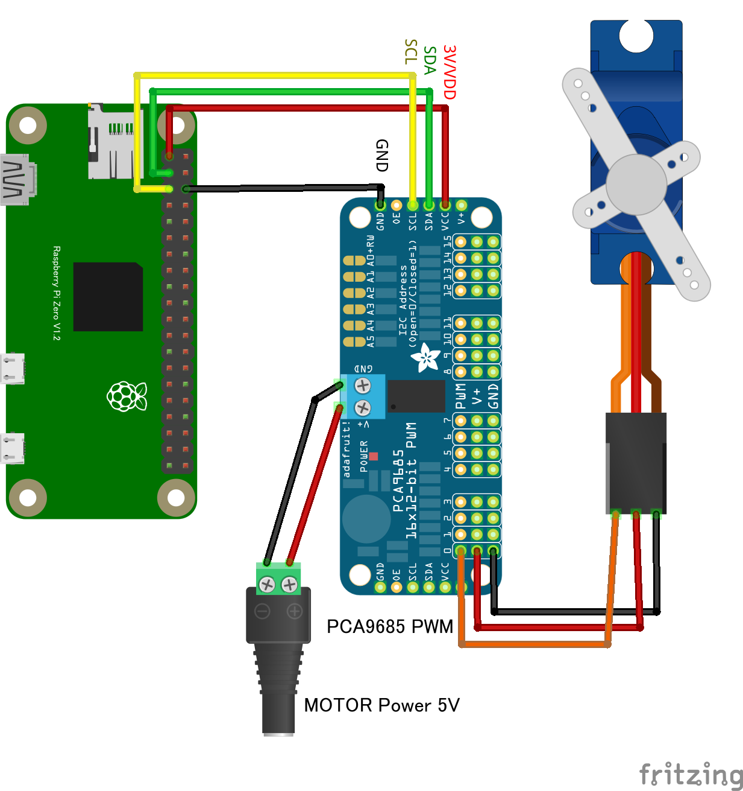

# PCA9685 16 チャンネルサーボモーター PWM ドライバー

## 配線図




## Chirimen PCA9685ドライバ補足説明書: `init`関数の引数

このドキュメントは、Chirimen環境で使用される *PCA9685* ドライバの初期化関数 init の引数について、詳細な補足説明を提供します。

```javascript init: function(minPulse, maxPulse, angleRange, noSetZero)```

---
### init 関数の引数説明
| 引数名 | 説明 | 単位 | デフォルト値 | 補足事項 |
| :--- | :--- | :--- | :--- | :--- |
| *minPulse* | *最小パルス幅* | sec (秒) | 0.0011 | サーボが到達できる最小角度に対応するパルス幅。 |
| *maxPulse* | *最大パルス幅* | sec (秒) | 0.0019 | サーボが到達できる最大角度に対応するパルス幅。 |
| *angleRange* | *±最大回転角* | deg (度) | 30 | 中央値からの、minPulse/maxPulse 設定時の ± 回転角。*角度指示のずれ* に影響 (次項参照)。 |
| *noSetZero* | *初期位置設定の有無* | - | false | init 実行時にサーボを中央値 (0[deg]) にセット*しない*場合は true を設定。 |

* minPulse, maxPulse, angleRange は使用するサーボモーターによって異なります。
* 一般的なサーボの目安: minPulse: 0.001 [sec], maxPulse: 0.002 [sec], angleRange: ± 60 [deg]
---
### 設定値のカスタマイズと注意事項
#### 1. minPulse と maxPulse について（*物理破損* の注意）
* *物理的な破損のリスク*:
    * minPulse を *過小* に、maxPulse を *過大* に設定すると、サーボモーターが規定の動作範囲を超えて回転しようとし、*物理的に破損* する可能性があります。
    * *デフォルト値* (0.0011, 0.0019) は、*安全性を考慮* して設定されています。値を調整する際は、*サーボの仕様書* を確認し、慎重に行ってください。
#### 2. angleRange について（*角度指示のずれ* の注意）
* angleRange は、*PCA9685ドライバが角度指示をパルス幅に換算する際の計算係数* です。
* この値がサーボの実際の最大回転角と異なっていても、*サーボモーターが物理的に破損することはありません*。
* ただし、angleRange を誤って設定すると、プログラムで $45[\text{deg}]$ と指示しても、サーボの実際の回転角度が $45[\text{deg}]$ から*ずれてしまう* 点に注意が必要です。
---
### 参考情報
サーボモーターのパルス幅と角度の関係についての一般的な情報は、以下のリンクなども参照してください。
* http://mycom1.cocolog-nifty.com/blog/2010/07/rc-83ee.html
