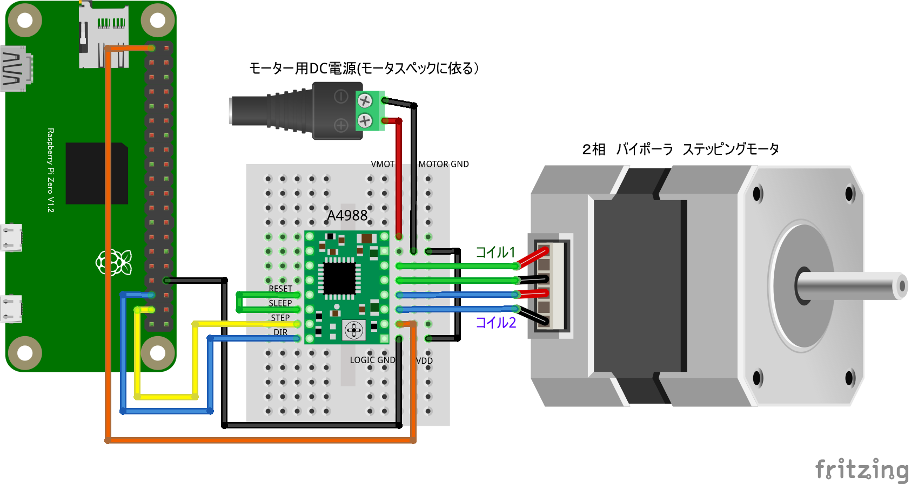

# リモートステッピングモータ制御

## 配線図

STEP端子をGPIO PORT26、DIR端子をGPIO PORT19に繋ぎます

> [!WARNING]
> ステッピングモータは停止中も常に電流が流れているため容易に加熱します。火傷に注意！

> [!WARNING]
> Node.js v20 では `WebSocket` が実験的機能としてデフォルト無効のため、Raspberry Pi Zero 側で `node main.js` を実行すると `nodeWebSocketClass and OriginURL are required.` というエラーで終了します。
> `node --experimental-websocket main.js` のようにフラグを付けて実行してください (v22 以降ではフラグ不要です)。

## 遠隔コントローラ(PC/スマホブラウザ)側

[pc/index.html](https://codesandbox.io/s/github/chirimen-oh/chirimen.org/tree/master/pizero/src/esm-examples/remote_a4988/pc?module=pc.js)を起動します。

回転方向（正転・逆転）とステップ数を指定して「回転開始」ボタンを押すと、その場でステッピングモータが指定ステップ数だけ回転します。
