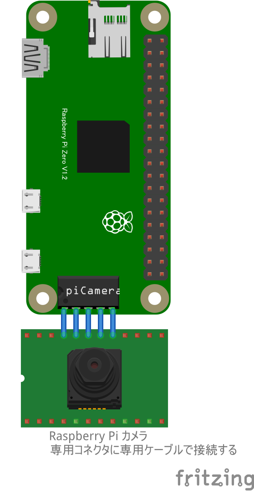

# GPIOスイッチによるカメラ撮影 (remote_Camera)

## 配線図

> [!WARNING]
> Node.js v20 では `WebSocket` が実験的機能としてデフォルト無効のため、Raspberry Pi Zero 側で `node main.js` を実行すると `nodeWebSocketClass and OriginURL are required.` というエラーで終了します。
> `node --experimental-websocket main.js` のようにフラグを付けて実行してください (v22 以降ではフラグ不要です)。

タクトスイッチはGPIO PORT5に繋ぎます。

カメラは専用コネクターに専用ケーブルを使って接続し、更にセットアップが必要です。[こちらを参照してください](../gpio-camera/readme.md)
