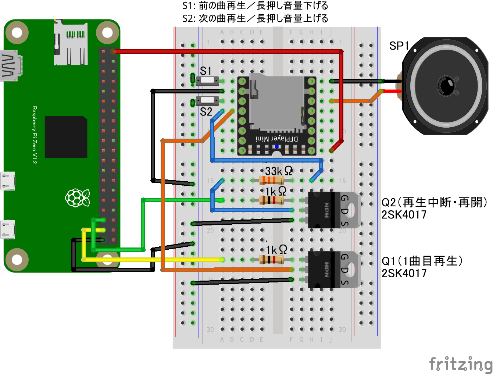

# リモートMP3プレーヤー基板

## 配線図

* DFPlayer MiniボードのADKEY1端子をNchMOSFETを介してGPIO PORT26で、ADKEY2端子をGPIO PORT19で制御します
(他にシリアル通信での制御も可能なボードですがこのサンプルはGPIOで制御できるADKEY端子を使用)
* 電源投入後、ボリュームが最大になるのでS1スイッチは付けておきましょう
* ADKEY1/2端子と抵抗を組み合わせることでいろいろなコントロールが可能です。GPIO端子の使用数を増やすと制御できる種類も増やせます。[こちらのページ](https://chitakekoubou.blogspot.com/p/dfplayeradkeyio.html)や、[メーカーサイトの説明ページ](https://wiki.dfrobot.com/DFPlayer_Mini_SKU_DFR0299)を参考に

> [!WARNING]
> Node.js v20 では `WebSocket` が実験的機能としてデフォルト無効のため、Raspberry Pi Zero 側で `node main.js` を実行すると `nodeWebSocketClass and OriginURL are required.` というエラーで終了します。
> `node --experimental-websocket main.js` のようにフラグを付けて実行してください (v22 以降ではフラグ不要です)。

## 遠隔コントローラ(PC/スマホブラウザ)側

[pc/index.html](https://codesandbox.io/s/github/chirimen-oh/chirimen.org/tree/master/pizero/src/esm-examples/remote_dfplayer/pc?module=pc.js)を起動します。

「1曲目を再生」ボタンで1曲目の再生を開始し、「再生/一時停止」ボタンで再生と一時停止を切り替えられます。
