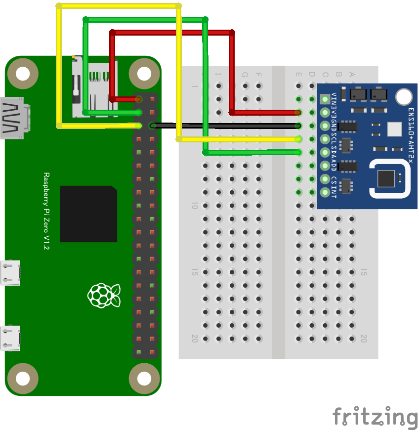

# リモート空気質センサ

## 配線図

Note: 配線図のモジュールは、ENS160に加えてAHT20(温度湿度センサ)も載っている複合センサボードです。(ENS160は温度と湿度の設定が必要)

> [!WARNING]
> Node.js v20 では `WebSocket` が実験的機能としてデフォルト無効のため、Raspberry Pi Zero 側で `node main.js` を実行すると `nodeWebSocketClass and OriginURL are required.` というエラーで終了します。
> `node --experimental-websocket main.js` のようにフラグを付けて実行してください (v22 以降ではフラグ不要です)。

## 遠隔モニタ(PC/スマホブラウザ)側

[pc/index.html](https://codesandbox.io/s/github/chirimen-oh/chirimen.org/tree/master/pizero/src/esm-examples/remote_ens160/pc?module=pc.js)を起動します。
